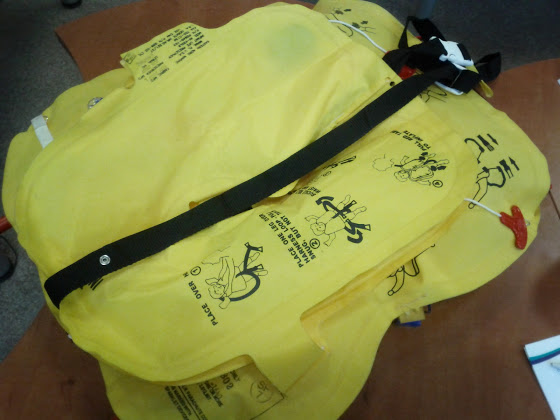
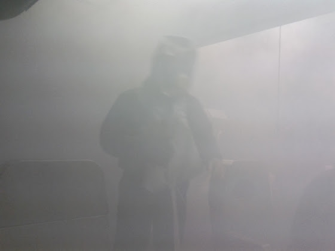

# Ditching & Fire fighting

На днях я прошел пару дополнительных курсов - Ditching Procedures Training и Real Fire Fighting.

Ditching - это приземление на воду. В авиации все возможно, поэтому нужно быть к этому готовым.

<!-- more -->

Сначала была теория: как пользоваться жилетами, как вести себя на воде, что пить, куда плыть, куда не плыть, как спасать народ, как это все организовать и т.д.

Один интересный момент по поводу надувания жилетов в салоне самолета. Я раньше этому не придавал особого значения, а зря. Проблема не в том, что надутый жилет будет мешаться пройти между рядами или выйти из самолета, и даже не в том, что его можно повредить. Смысл в том, что если эта многотонная крылатая махина вдруг перевернется, развалится и пойдет под воду, то с надутым жилетом в самой уже воде тебя притянет к верхней части салона и хрен ты от туда выберешься. Что-то похожее случилось с пассажирами рейса 961 эфиопских авиалиний - большая часть из них выжила при приводнении, но не все сумели выбраться из самолета и просто утонули.

Это теория. Практика у нас была в бассейне. Первое упражнение - прыгнуть в бассейн, надеть на себя жилет и надуть его. Задача усложнялась тем, что одна часть жилета автоматически не надувалась. Все помнят, как стюардессы перед полетом показывают, что жилет можно поддуть легким "уууффф"? А вот и нет, особенно, если ненадутая камера оказалась внизу, т.к. верхняя просто мешает подтянуть трубку ко рту. Ну и нужно прилагать усилия, примерно как надуть только что купленный воздушный шарик.

Дальше нужно было держаться на воде поодиночке в позе эмбриона, не двигаясь (экономим силы) и в группе. Преимущество собираться в группе в том, что сверху большой желтый круг (красные и оранжевые жилеты только у пилотов и стюардесс) из людей проще заметить, чем одиноко плавающую точку. Потом один из нас изображал потерявшего сознание, а другой пытался его дотащить до берега. Это можно сделать двумя способами - схватить за жилет и плыть на спине, или обхватить ногами за талию, и опять же, плыть на спине. Первый способ мне показался более удобным. По поводу плыть… комфортно с жилетом можно плыть только на спине, в любых других позах очень неудобно. Ну и вообще, плыть куда-то нецелесообразно, если только ближайший берег ну вот прям совсем рядом.

Последним упражнением было забраться на трап. Во-первых, вскарабкаться на него мешает жилет, во-вторых, трап предназначен для эвакуации,  и на воде он не очень устойчив(мы два раза переворачивались). Поэтому если вдруг самолет приводнился где-нибудь на Кипре в августе, и температура воды чуть меньше 36 градусов, проще просто держаться возле трапа и не пытаться на него залезть.

Второй курс - Real Fire Fighting, ну т.е. как бороться с огнем. Опять, сначала теория про огнетушители, виды пожаров, как тушить, как пользоваться экипировкой и т.д. В конце - реальная практика по тушению пожаров.

В Балтик Академии есть специальный симулятор, аля часть салона самолета, но вместо обычного интерьера там все сделано из металла. Огонь - настоящий, поэтому приходилось пользоваться настоящими перчатками, маской и огнетушителями, только дым специальный и неопасный. Тушить нужно было кресла, багажную полку, туалет и печку. Вот там на фото вверху еще ооочень мало дыма, самая жесть была - это при выключенном свете практически при нулевой видимости найти "пропавших" пассажиров.