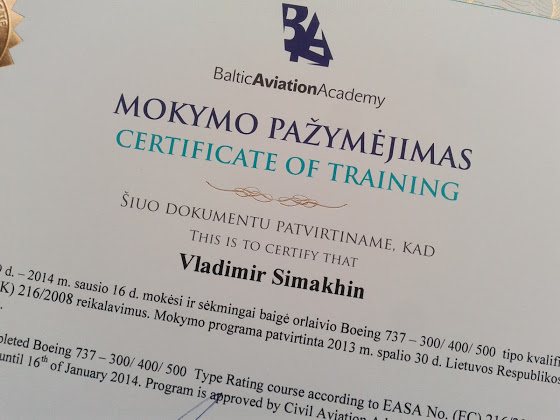

# Skill Test

Вчера сдал skill test - экзамен на симуляторе, предпоследний шаг для получения тайп-рейтинга. Сейчас все расскажу, но для начала немного о самих сессиях на симуляторе.

<!-- more -->
Всего у нас было 8 сессий, не считая трех на МСС и еще трех неофициальных во время изучения SOP. Каждая сессия - обычный полет минут на 10 с touch-and-go вокруг аэродрома (летали в Манчестере) для разминки, а потом оставшиеся 3 часа и 50 минут  - отработка всевозможных проблем, отказов, пожаров и прочее. Самые частые упражнения: отказ или пожар двигателя на взлете, windshear (сдвиг ветра),, отказ двигателя при заходе, ну и соответственно ILS/VOR/NDB заход с одним двигателем на автопилоте или вручную с или без флайт директоров.

В итоге, практически все, что есть в QRH - все это мы отрабатывали. Мое любимое  - это Runaway Stabilizer (пару таких упражнений в день и в спортзал ходить не нужно), Emergency Descent (просто интересно) и Flaps Up Landing (190 узлов перед касанием полосы - очень впечатляет :). Полет и заход с одним двигателем мне уже кажется каким-то обыденным процессом, кажется, что это что-то само собой разумеющееся, и ничего страшного в этом нет - все действия уже делаешь на полном автомате. Приземление при сильном боковом ветре - тут я вспомнил все, чему меня учили, когда я летал на ультралайте. Вот честно, на цессне и двухсотке техника та же самая, но все ощущения именно как на зефирке.

Инструктор нам практически никогда не давал повторяющиеся задания. Если сейчас отказал левый двигатель на взлете, и ты отработал не совсем гладко, то после небольшого дебрифинга прямо в кокпите, в следующий раз не факт что опять откажет левый, или даже правый двигатель. Может быть будет сдвиг ветра, может быть пожар APU, а может быть будет просто Flaps Assymetry. То есть совсем не возможно было подготовиться к конкретной проблеме, всегда нужно было быть готовым ко всему. По поводу самих инструкторов. На теории у нас был КВС-инструктор, летающий на всех модификациях 737, а на симуляторе - тоже КВС-инструктор, с налетом в 23 000 часов. Кроме того что они очень опытные, по отношению видно, что их главная цель - научить тебя, а не просто провести занятие и поставить галочку в журнале.

И так, возвращаемся к скилл-тесту. Я был первым в качестве Pilot Flying. Наш тестовый полет был из Лондона в Манчестер - ввели в FMC, выполнили все процедуры (Preflight, Before Start, Before Taxi, Before TakeOff) и полетели. Сразу же после взлета, еще до начала уборки закрылков, был windshear (сдвиг ветра), после чего у нас сработала сигнализация Wheel Well Fire. Потом мы набрали FL230 и там у нас произошла разгерметизация - экстренное снижение до 10 000 футов, и где-то миль за 20 до Манчестера у нас отказал двигатель, мы встали в холдинг, попробовали перезапустить его, получили пожар двигателя, потушили и пошли на посадку по ILS с боковым ветром в 25 узлов (около 45 км/час). На снижении у меня отключились директоры и я продолжил снижаться полностью в ручном режиме. На минимумах я оказался примерно в 25-30 метрах  правее от полосы и дал команду на уход на второй круг (потом экзаменатор сказал, что если бы я попытался сесть, а многие пытаются довернуть, то я бы не сдал). Второй заход был уже по ILS на автопилоте, который я отключил уже на минимуме. Касание, speed brake в ручном режиме, и у нас вдруг срабатывает сигнализия пожара APU. Тушим, проводим эвакуацию. Все, первые 2 часа мы отлетали.

Следующие 2 часа в правом кресле был Карлос, и мы летали просто вокруг аэродрома: отказ гидравлики B, TCAS, отказ левого двигателя, заход без директоров по ILS, уход на второй круг.

В конце, после дебрифинга, где экзаменатор обсудил с нами наши ошибки, мы получили в наши документы заветное "Passed".

Ну вот, на следующей неделе я лечу в Данию на base-training, где нам нужно будет выполнить 6 приземлений уже на настоящем самолете. А потом сразу в Прагу проставлять тайп-рейтинг в лицензию.