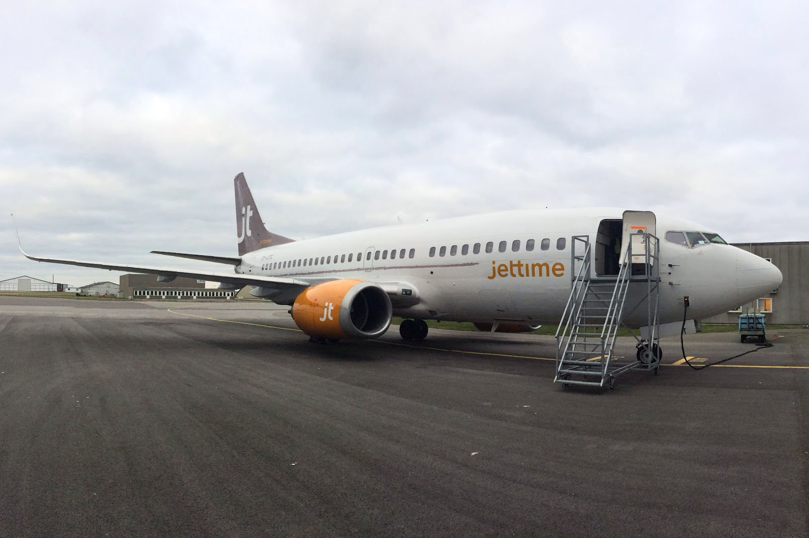
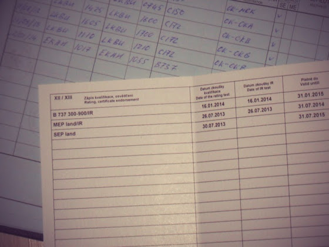

# Base Training

Base training, или аэродромная практика по-русски, у нас была в Дании на аэродроме Aarhus (EKAH).

<!-- more -->
Ну так вот, всего нас было 6 человек + 2 инструктора. Мы стартовали из аэропорта Копенгагена, поэтому первому и последнему в списке (я был вторым) повезло лететь практически настойщий leg на высоте FL120.

Сама практика проходила примерно так: первый взлет с закрылками 5 с флайт директорами до высоты 1600 футов, поворот на crosswind, практически сразу же на downwind, after takeoff и descend чеклисты. Перед baseleg approach чеклист, поворот, отключение флайт директоров, закрылки 15, выпуск шасси, поворот на final, закрылки 30, landing чеклист, посадка с touch-and-go, взлетная конфигурация и сам взлет. Дальше все то же самое, но первый поворот уже на 400 футах, и весь оставшийся полет вручную без директоров. Шестое приземление с фулл-стоп, реверсами, спойлерами и торможением. На рулежке потом смена студента.

Управлять настоящим боингом оказалось немного проще, чем это было на симуляторе, только тримминг как-то необычно (медленно) работал, но потом под конец уже привык. Приземления тоже легче выполнять на реальном самолете, ну и скорость чувствуется лучше. Из необычного еще могу отметить, что двигатели довольно быстро реагируют на движение РУДов, я ожидал большей задержки.

А вообще, это было настолько охренительно летать на настоящем боинге, что словами это просто не передать!

Ну а на следующий день я быстренько съездил в Прагу и вписал себе тайп-рейтинг в лицензию. Так что теперь я официально пилот Boeing 737

