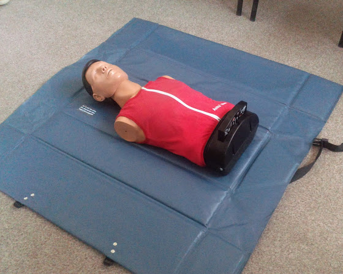
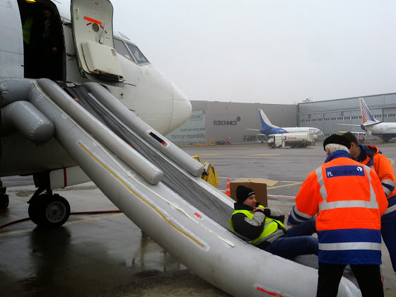

# Еще теория

Я тут опять понаехал в Вильнюс, чтобы прослушать еще несколько курсов теории.

First Aid. Какие бывают аптечки, что в них лежит, как использовать, что делать при ранениях, ожогах и переломах, как делать непрямой массаж сердца и искусственное дыхание и много всего другого.

Курс проходят как минимум раз в два года, т.к. рекомендации постоянно меняются. Например, нечто подобное я проходил еще в школе лет 20 назад, и нам рассказывали, что для непрямого массажа сердца нужно мысленно разделить грудную клетку на 3 части и давить на 2\3 с периодичностью около 60 раз в минуту. Сейчас все по другому: просто давить на середину грудной клетки с перидом 120 нажатий в минуту, через каждые 30 нажатий делать два выдоха рот в рот.  Для практики мы использовали вот этот тренажер

<!-- more -->

Он показывает силу нажатия, рейт, силу вдоха и переломы грудной клетки. Вообще, это не так уж и легко, после пары минут ты уже просто выдыхаешься и тебе нужен "сменщик".

Emergency equipment. Про все оборудование для нештатных ситуаций, аля огнетушители, PBE (Protective Breathing Equipment), топоры, кислородные балоны, мегафоны, трапы, запасные выходы (кстати, они очень просто открываются и также просто ставятся обратно) и т.д. и как все это использовать.

Dangerous Goods. Какие бывают опасные грузы, как они классифицируются, как их перевозить, что делать, если нарушилась упаковка, что делать в случае нештатной ситуации. Вообще интересно, т.к. из-за неправильной упаковки или несоблюдения просто самых обычных процедур случаются катастрофы по типу ValueJet Flight 592.

CRM (Crew Resource Management). Что это такое, зачем это нужно, какие предпосылки были для этого, как строить отношения в кокпите, что такое человеческая ошибка и т.д. Основная мысль - работать нужно в команде, а не так, что капитан управляет самолетом, а второй пилот ему не мешает.