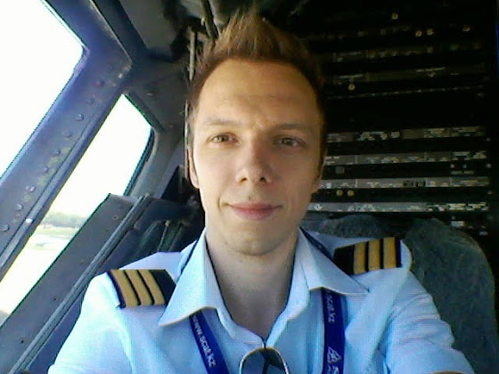

# Обзервер

Начал летать обзервером, в общем, вливаюсь в процесс. Первый рейс был в Алматы, еще я успел слетать в Астану и Домодедово. Круче всего ночной заход в Шымкенте.

В процессе слежу за работой пилотов, учусь заполнять всю документацию и подготавливать кабину к полету, отвечаю на вопросы инструктора (почему это, почему то, зачем нам вот это, почему именно так, а не по другому, что делать в таком-то случае и т.д.). Скучать не приходится.

Ну и я  во время перерыва между рейсами (сижу в кресле второго пилота), фотографировал на штурвал.

