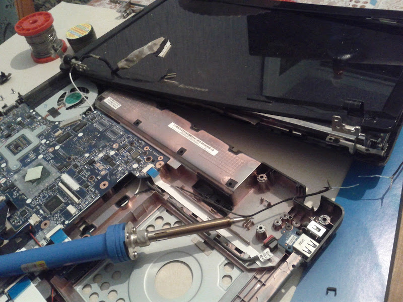
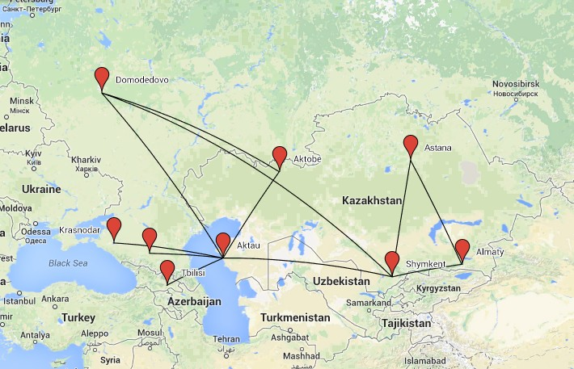
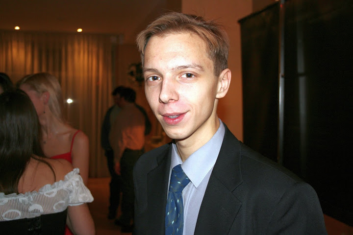
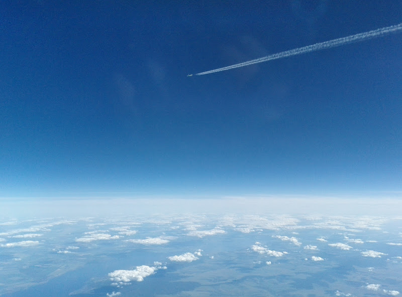

# Наоборот

Раньше, когда я работал еще в IT, самолеты у меня были просто как хобби. Теперь же все наоборот - бывает, что в свободное время я открываю nano/gedit, пару консолей с пайтоном и пишу… например, скрипт для подсчета сводной статистики по своим полетам. Или консольный калькулятор для подсчета времени в бумажных лог-буках и отчетах. Ну а так как у меня в дипломе еще есть приставка "инженер", и руки вроде растут из правильного места, то бывает чиню и "железо", после того, как на нем попрыгали дети

<!-- more -->

Раньше были разные дни, может 50 строк кода за день напишешь, а может почти под 1000. А потом запускаешь все это в продакшн на 2000+ серверах и с удовольствием идешь на кружку чешского пива. Сейчас у меня разные рейсы: короткие, длинные, дневные, ночные. Иногда не замечаешь, как отлетал все задание, а иногда бывает и устаешь, но в любом случае нужно съесть ведро лимонов, чтобы стереть довольную улыбку с лица, и то не факт, что поможет.

Буквально еще год назад в наушниках на работе у меня играло какое-нибудь интернет радио или подборка вконтакте. Сейчас в них только голос диспетчера и других бортов в воздухе.

Раньше при вскрытии девайса я вдыхал этот непередаваемый запах нового железа, планки памяти, только что крутившегося харда или еще горячего процессора. Теперь на стоянке точно так же я могу прочувствовать запах самолета - двигатели, шасси, кокпит.

Ну и одежда. Еще в 2008, когда я увольнялся из одной консалтинговой компании, я сказал себе, что больше никогда не будут носить костюм и галстук - ума это не прибавляет, а большинство компаний с таким обязательным требованием обычно со своими тараканами. Сейчас я с удовольствием ношу униформу - вроде бы тот же костюм, ан нет, как только снимаю погоны, сразу чувствую себя не в своей тарелке - так и хочется переодеться обратно в джинсы. Я из 2003…

Скучаю ли я по своей старой работе? Неа! Момент, когда ты отрываешь самолет от полосы, неважно 60-и тонный боинг это или одномоторная двухместная цессна, ты просто оказываешься в другом мире, и понимаешь, что в воздухе на крыльях - это как раз то, чем ты хочешь заниматься всю жизнь.

