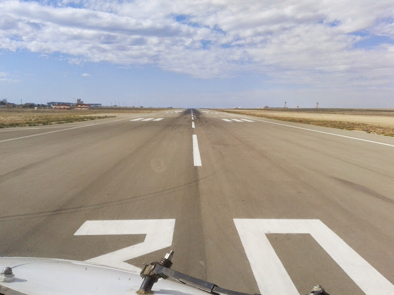

# Один день

Вот, давно хотел написать пост в таком стиле, все никак не получалось целиком сфотографировать день. Тут тоже фото будут трех дней  (качество не очень, снимал на правый двигатель свой старый андроид-смартфон), и не только мои - позаимствовал у одного из споттеров, которые снимали наш заход в Астане. В общем, поехали… один мой рабочий день как второго пилота боинга 737.

<!-- more -->
7:41 Актау. Гостиница. Открываю глаза… хм, раньше будильника на 20 минут. Ну что, пора вставать, хотя и темно еще за окном.


Быстро проверяю почту, вдруг там что-то срочное\интересное пришло. По наряду у меня сегодня два рейса: из Актау в Астану и из Астаны в Шымкент.

08:20 Умываюсь

08:50 За окном уже заметно посветлело

08:55 Контрольный звонок от капитана, и идем на завтрак

09:10 Завтрак. Обязательно чашка двойного эспрессо, а еще лучше дабл двойного


10:00 Возвращаюсь в номер, заполняю лог-буки, подвожу статистику, ну и занимаюсь делами по мелочи. На заднем фоне показывает Дискавери на английском. Вообще, если нахожусь где-то в гостинице, то практически всегда у меня включен какой-нибудь англоязычный канал.

10:44 Пора распечатать задание и остальные документы. Заодно готовлюсь к полету: читаю НОТАМы, смотрю погоду, схемы заходов и сам маршрут.


11:27 За окном уже совсем светло. Раньше в Актау в это время уже было жарко, около +30, сейчас же только +17 и сильный ветер.

11:36 Пора погладить рубашку


11:41 Готово (мой первый лук в лифте :)


12:41 Чуть меньше часа до приезда машины, которая отвезет экипаж в аэропорт. Собираю все вещи и одеваюсь.


13:30 Машина подъехала. Пора на работу

14:50 Проходим санчасть. Кэп заодно проводит брифинг и дает указания по заправке.


15:00 Едем на борт

15:03 Мое рабочее место. Начинаю готовить кабину


15:10 Заправляемся


15:25 Капитан вернулся с ВДП, берем условия выхода

```
- Aktau Tower, Vlasta 741, good afternoon, stand 202, information Y, request ATC clearance to Astana
- Vlasta 741, good afternoon, you’re cleared to Astana as filed, departure RIBNA 2B, flight level 330, squawk 3435, Aktau Tower
- Departure RIBNA 2B, flight level 330, squawk 3435, Vlasta 741
- Read back correct, Aktau Tower
- Vlasta 741
```

15:35 Буксировщик ждет, пока подсоединят водило


15:45 Все документы на борту, пассажиров пересчитали, количество багажа и груза сходится, можно и закрываться.

16:00 Буксируемся и запускаемся

16:06 Поехали

16:07 Занимаем исполнительный. В Актау руление на исполнительный идет по полосе


16:12 На исполнительном

```
- Vlasta 741, ready for departure
- Vlasta 741, cleared for take off runway 30, Aktay Tower
- Cleared for take off, runway 30, Vlasta 741
```

Капитан отдает управление

```
- Your controls
- My controls. Lights on, taxi off, timing.
- Lights on, taxi off, timing
- Set initial thrust
- Initial thrust set, stabilized
- Set take off thrust
- Take off thrust set, N1, TOGA
```

... и 2 двигателя вжимают тебя в кресло



16:27 Набрали эшелон 350


16:30 Все системы в норме, двигатели работают, температура в салоне +26, за бортом -50

16:50 Сегодня на обед курица с рисом, закуски и яблочный сок


17:10 Верхняя кромка облачности поднимается все выше, забираемся на 370 эшелон

17:40 200 миль до Астаны, беру погоду и начинаю готовить самолет к снижению. Все по правилу 5B: Bugs (ставим минимум на высотомере и Vref/Vref+15 на указателе скорости), Bearing (курс захода по ILS/VOR/NDB), Brakes (уровень автобрейков), Boxes (частота ILS/VOR/NDB), Briefing (в буквальном смысле рассказываю как я буду снижаться, как заходить, когда отключать автопилот и т.д., чтобы для другого пилота не было неожиданностью какое-либо из моих действий)

17:54 Снижаемся

18:14 Speed brakes up! Reversers unlocked! Autobrake in use! - Приземлились


18:17 Зарулили на стоянку. Следующий рейс на Шымкент через 40 минут, сразу начинаем готовить кабину

18:20 Заправка подъехала


18:42 Борт готов, даем команду на посадку пассажиров. Буксир уже подцепился


18:59 Бумаги на борту, данные по багажу сходятся, а вот одного пассажира не хватает.

19:00 Еще один наш борт прилетел из Алматы


19:05 Пассажир наконец-то дошел до самолета. Закрываемся.

19:10 Буксировка и запуск

19:13 Поехали. Занимаем предварительный. Перед нами взлетает ЭйрАстана, опять ждем.


19:21 Взлетаем


19:45 Заняли 320 эшелон. Диспетчер дает спрямление сразу на точку BETPU


20:11 За бортом становится уже темно


20:25 Готовимся к снижению


20:49 Посадка

20:53 На стоянке

21:17 Сдаем техникам самолет

21:25 Забегаю в эскадрилью, сдаю задание и документы

21:30 Машина забирает экипаж и развозит нас по домам

22:12 Я дома.