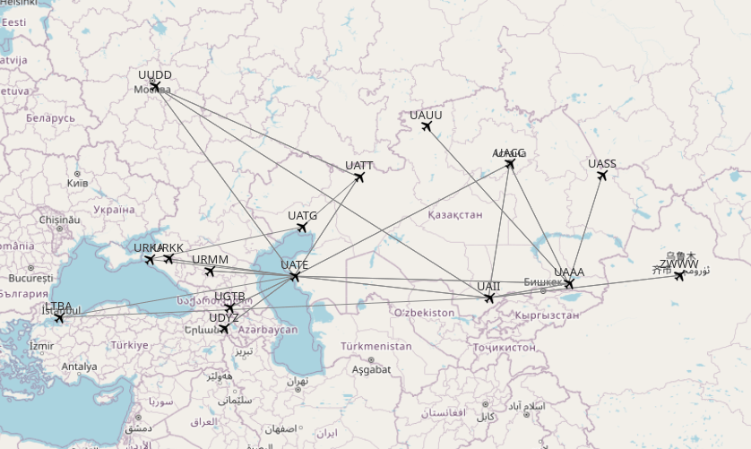

# На контракт

В апреле этого года после получения тайп-рейтинга , я приехал в Казахстан на программу стажировки. На прошлой неделе я ее закончил. И так, небольшие итоги

* 8 месяцев
* 500 часов блок тайма на правом кресле
* 9 успешно сданных проверок с инструкторами/экзаменаторами
* 15 аэродромов по различным маршрутам
* 236 выполненных рейсов
* 153 посадки днем и 83 ночью
* 5 часов 21 минута - самый продолжительный рейс
* 52 минуты - самый короткий рейс

Что же дальше? А дальше контракт на год вторым пилотом. Я уже успел съездить в Вильнюс на тренажер, пройти годовой чек (он же очередной полугодовой), проездом забежать в САА в Праге, продлить тайп-рейтинг еще на год, ну и пройти очередную медкомиссию у своего врача.