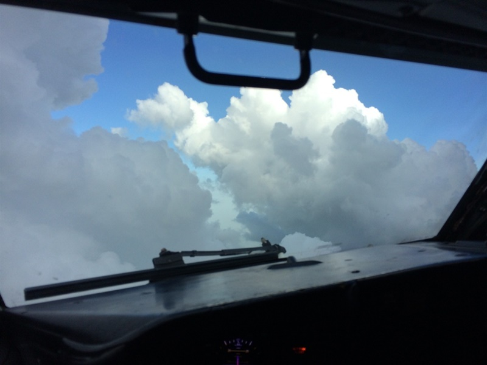
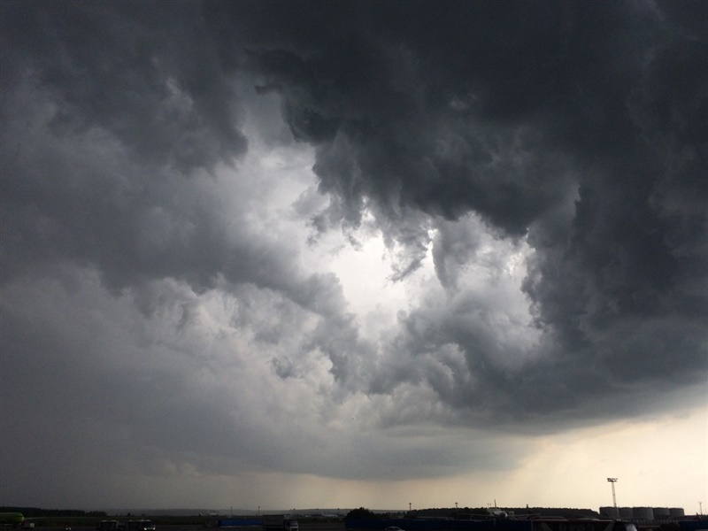
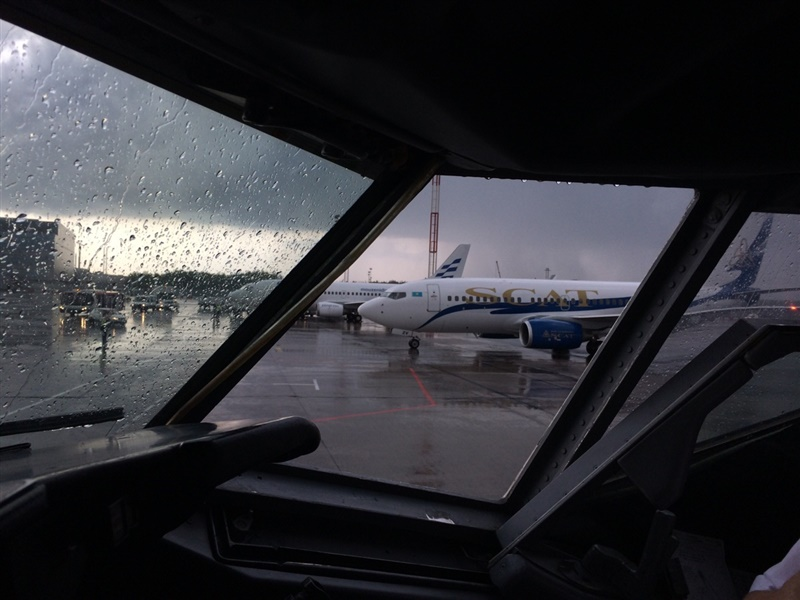
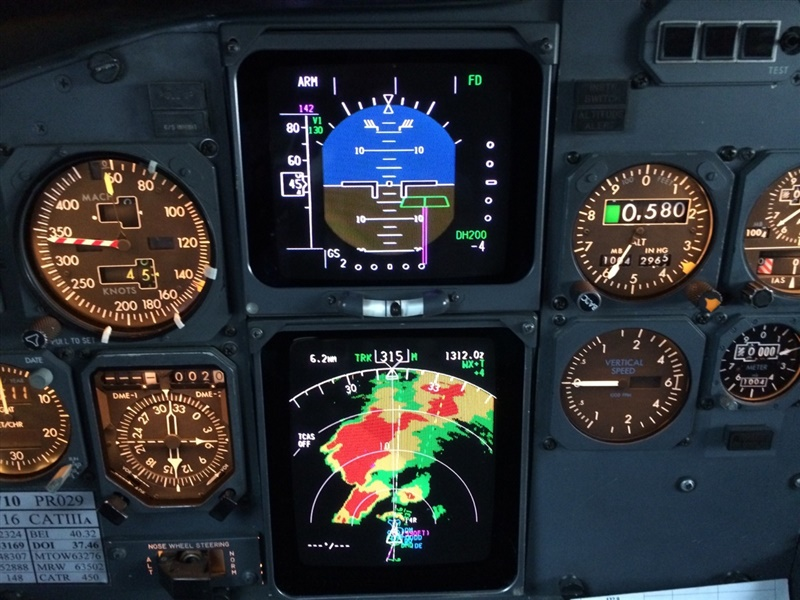
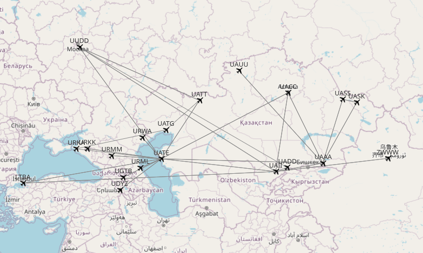
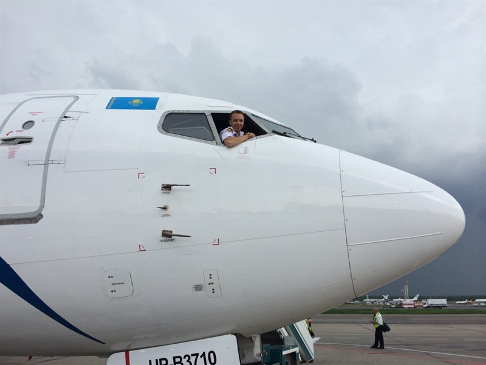

# Последние дни вторым пилотом

В последнюю мою неделю работы погода мне сделала сюрприз - кучевки, грозы, ливневые дожди, молнии, град и порывистый ветер. Ну одно удовольствие летать в такую погоду! Вот, к примеру, как это было в Домодедово по метару

```
UUDD 291700Z 27006MPS 9999 -TSRA BKN033CB BKN100 18/16 Q1006 WS R32R R88/290095 TEMPO VRB17MPS 0500 +TSRAGR
UUDD 291600Z 03005MPS 350V070 7000 0900N R14R/P2000 R14L/0900 +SHRA BKN020CB 18/16 Q1003 R88/290095 TEMPO VRB17MPS 0500 +TSRAGR
UUDD 291500Z 34004MPS 310V060 9999 BKN040CB 19/16 Q1003 R88/290095 TEMPO VRB17MPS 0400 +TSRAGR
UUDD 291400Z 34005MPS 290V050 9000 -TSRA BKN033CB 19/17 Q1004 RESHRA R88/290095 TEMPO VRB17MPS 0400 +TSRA
UUDD 291300Z 32003MPS 9999 -TSRA BKN040CB 20/17 Q1004 RESHGR R88/290095 TEMPO VRB17MPS 1000 TSRA
UUDD 291200Z 27002MPS 9999 TS SCT046CB BKN200 27/19 Q1004 R88/010095 TEMPO VRB18MPS 0500 +TSRAGR
```

На подлете над Аксинино все было более менее прилично

<!-- more -->

А вот ближе к земле уже начиналось самое интересное




Что уж там говорить, борт из Иордании еще на предварительном запросил руление обратно на гейт, хотя перед ним уже взлетели 5 других. Интервал между бортами был 5-8 минут. Каждый самолет занимал исполнительный и начинал искать на радаре дырку, куда бы можно было уйти. Вот так у нас отсвечивало в сторону захода на 14ю полосу, на взлет было примерно то же самое.


Это был охренительный прощальный подарок. Жалко, что такие полеты бывают только один раз из ста.

Ну и немного статистики


* ровно год полетов на 737, летать начал в июне прошлого года
* общий налет на B737  - 722 часа
* 348 выполненных рейсов
* самый длинный рейс (UAII - LTBA) - 5 часов 21 минута
* самый короткий рейс (UASS - UASK) - 28 минут с учетом руления
* налетано 462 247 км (~11.5 раз обогнуть землю по экватору)
* средняя скорость 640 км\час (с учетом руления)

В общем, спасибо, что воспользовались нашей авиакомпанией. А я через пару дней улетаю в Москву доделывать документы.

