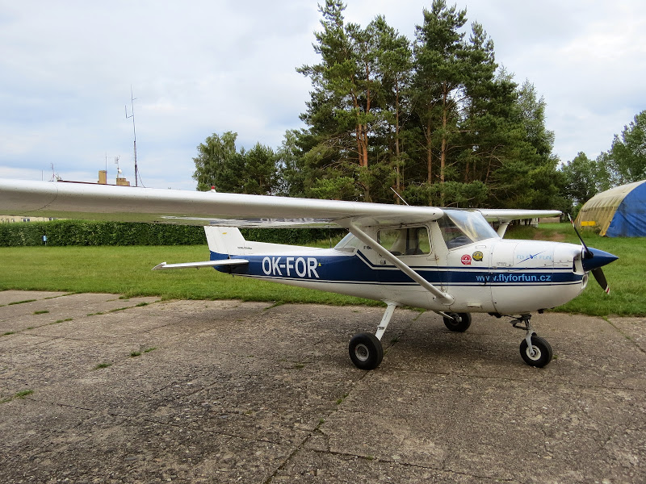
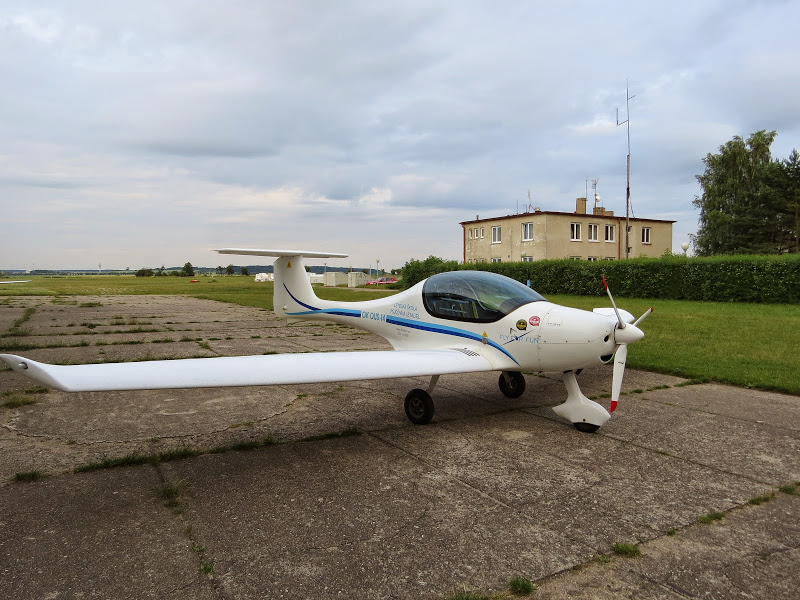

# Летаааать

Breaking news!! Выхожу на связь с капитанского кресла. Немного непривычно управлять самолетом левой рукой

На выходных съездил на аэродром и сделал несколько тач-н-гоу с инструктором и соло.

Первая посадка и я выхожу на выравнивание на высоте кабины В737. Инструктор, конечно, посмеялся, но попросил делать это чуть ниже. Ну и ротейт делать на 50 узлах тоже непривычно. А вообще очень скучал по цессне, совсем другие ощущения. В планах в ближайше время продлить свой SEP рейтинг, и тогда начну опять устраивать покатушки.

А вот на таком я начинал летать еще в 2010 году. Ультралайт, но летает как настоящий самолет, 140 км/час в круиз режиме.

