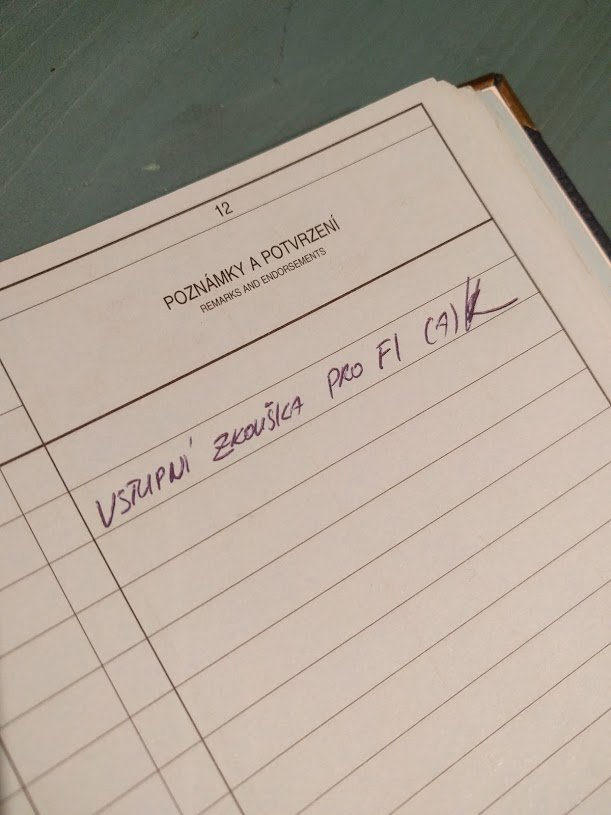

# FI - вступительный чек

Итак, возобновляю классические посты для этого блога на тему "как же проходит обучение на пилота". В данном случае буду писать о том, как получить FI (Flight Instructor) рейтинг.

Первое, что нужно знать - нельзя просто так стать летным инструктором. Минимальные требования - наличие CPL, а это подразумевает под собой сданную теорию CPL/ATPL и 200 часов налета. Второе - нужно сдать "предварительный" чек/экзамен. Буквально на днях я его как раз и сдал.

Сам чек проходит с инструктором инструкторов, который смотрит на то, как ты управляешься с самолетом (взлет, посадка, повороты на 30/45 градусов, сваливание), как объясняешь теорию (что это за приборы, как подготовить самолет к полету, почему так и вот так), как справляешься с проблемами в полете (отказ двигателя, выбор площадки, скорость снижения). То есть что-то похожее на выпускной экзамен на PPL, но при этом ты сидишь справа. Честно говоря, сидеть в правом кресле на цессне - это совсем не то же самое, что сидеть справа на боинге. На большом самолете все приборы дублируются, там практически все равно где сидеть. На цессне С150/С172 все основные приборы находятся слева, поэтому постоянно приходится смотреть в сторону.

Тут происходит взрыв кишки расчлененка, т.к. привычка постоянно сканировать приборы и горизонт в данном случае не работает - взгляд переходит с горизонта на панель, а там вместо искусственного горизонта уровень топлива и температуры масла. Но ничего, впереди еще летать и летать, так что должен привыкнуть. Весь курс длится 30 часов, один час из них будет на акробатическом самолете с выполнением штопора.