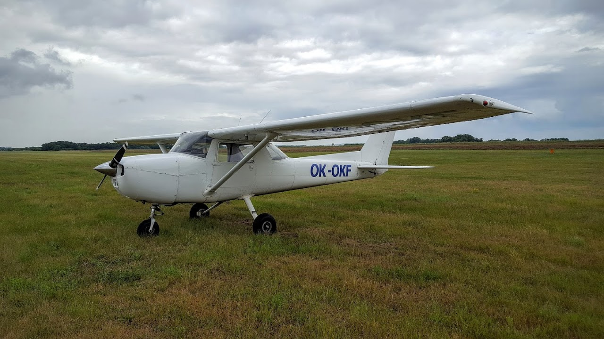

# Инструкторский. Первые часы

На прошлой неделе начал отлетывать свои первые часы на инструкторский рейтинг. До этого все никак не получалось - то самолет ждали, то погоды не было, то инструктор улетел на симулятор новый тайп рейтинг получать.

Сам курс достаточно простой, практически все то же самое, что и на PPL, но, как я об этом уже писал, все полеты проходят с правого кресла, как если бы ты летал инструктором с обычным студентом.

Ну и если раньше, при обучении на PPL, инструктор тебе все рассказывал, а ты спрашивал, то тут все наоборот. Ты не просто так без слов нажимаешь кнопки и дергаешь рычаги, а объясняешь, зачем это все делается.

<!-- more -->

Плюс в этот раз была интересная погода, периодически накрывало дождем, и вокруг были приличные темносерые кучовки.

```
METAR LKPR 171500Z 28008KT 9999 FEW025 21/16 Q1019 NOSIG
METAR LKPR 171430Z 30007KT 9999 FEW035 20/17 Q1019 NOSIG
SPECI LKPR 171419Z 30006KT 240V320 9999 FEW035 20/16 Q1019 RMK REG QNH 1015
METAR LKPR 171400Z 29007KT 9999 -SHRA SCT035 20/17 Q1020 NOSIG
METAR LKPR 171330Z 31013KT 9999 FEW025TCU SCT045 20/16 Q1020 NOSIG
SPECI LKPR 171305Z 31007KT 9999 -SHRA FEW020TCU SCT030 20/16 Q1020 RMK REG QNH 1015
METAR LKPR 171300Z 30008KT 9999 FEW020TCU SCT030 21/16 Q1020 TEMPO SHRA SCT020CB
METAR LKPR 171230Z 30005KT 260V330 9999 FEW020TCU SCT028 BKN040 20/16 Q1020 TEMPO SHRA SCT020CB
SPECI LKPR 171214Z 30007KT 9999 SCT025 BKN035 19/16 Q1020 RESHRA RMK REG QNH 1015
SPECI LKPR 171207Z 30006KT 270V330 6000 SHRA BKN028 20/15 Q1020 RMK REG QNH 1015
SPECI LKPR 171205Z 30006KT 270V330 9999 -SHRA BKN028 21/15 Q1020 RMK REG QNH 1015
METAR LKPR 171200Z 30007KT 270V340 9999 SCT025 BKN045 21/15 Q1020 NOSIG
METAR LKPR 171130Z 30009KT 9999 FEW025 BKN040 21/15 Q1020 NOSIG
METAR LKPR 171100Z 30008KT 9999 FEW020 SCT040 21/16 Q1020 NOSIG

TAF LKPR 171100Z 1712/1818 30008KT 9999 BKN025
 TEMPO 1712/1719 RA BKN013
 PROB30 TEMPO 1712/1716 4000 TSRA SCT026CB
 BECMG 1719/1721 SCT035
 PROB30 TEMPO 1812/1818 32012G24KT
```

Инструктор меня спросил, полечу я в такую погоду или нет. Вроде ничего серьезного, кучевки легко облетаются, минимумы соблюдены - почему бы и нет. Тогда он спросил по другому - а полечу ли я в такую погоду со студентом. Причем в нескольких вариантах: студент новичок, студент с опытом, студент в соло навигации. И вот тут уже пришлось задуматься.

Начинающему пилоту без опыта нет смысла лететь сквозь дождь и в сильную болтанку, т.к. у него еще нет уверенных навыков в обычных условиях. Такой полет не даст результатов, и просто будет потрачено дорогое летное время. И наоборот, если это студент с опытом, почти закончивший PPL, то имеет смысл с ним слетать и показать, что даже при условии соблюдения всех минимумов, полет может быть не очень комфортным.

Я помню, как в один из своих кросс-кантри полетов на PPL с инструктором видимость была около 5 км, и нижняя граница облаков была около 2500-3000 футов над землей. Инструктор мне тогда посоветовал остаться на земле, а я ему начал доказывать, что погода позволяет лететь. Инструктор поржал, и мы взлетели. На карте я потерялся уже минут через 15, пролетев мимо своей первой контрольной точки.

Ну и третий случай - студент-пилот в соло полете. Опять же, все зависит от опыта. Если это его первый вылет в соло на кросс-кантри, наверное стоит подождать лучшей погоды. Если же есть налет - почему бы и нет, он уже должен уметь принимать решения и расчитывать свои силы.

В общем, как-то так. Ну и фото паркинга в Водоходах, чтобы совсем скучно не было 
