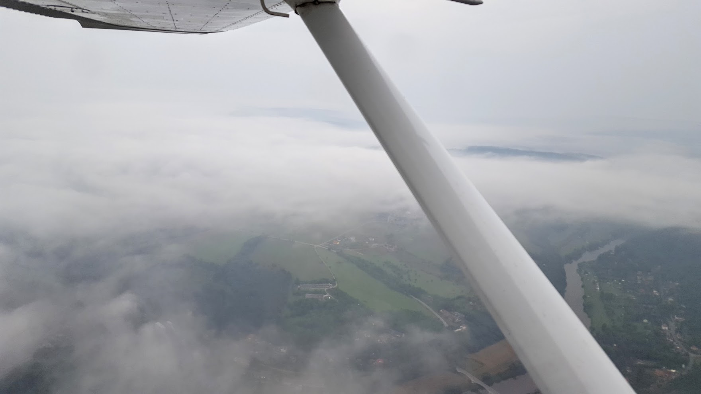

# Final, touch-n-go!

За последние три недели я сделал столько тач-н-гоу, сколько делал только во времена учебы на PPL.

Закрылки 30 - отлично! Теперь попробуем закрылки 40 - хорошо, немного снесло в строну, убираем обратно на 10, полный газ и взлет… ан-нет, инструктор убирает режим - отказ двигателя на взлете. Ну это легко, курс по полосе, закрылки 40, штурвал вниз и приземляемся.

А как насчет посадки без двигателя с высоты круга над полосой? Хех, это ж еще легче - скорость 80, разворот на вооброжаемый "даунвинд" и с него сразу "файнал" с закрылками 40.

Еще один круг, на этот раз посадка без закрылков. Ну это скорее всего на тот случай, если закрылки откажут. "Неа" - говорит инструктор, - "Это если студент забыл выпустить, а ты прошлепал". И так еще хитро улыбается...

А вот если над полем двигатель откажет - да легко. Уже автоматически ставишь нужные закрылки в зависимости от высоты и выбранного места. И шею уже не выворачиваешь так сильно, когда нужно просканировать авиагоризонт и скорость, как то уже даже привык летать с правого кресла.

И так раз 100 уже, не меньше. Ну и в качестве фото - раннее утро, вид из кокпита

