# Еще один перегон

Самолет, на котором мне нужно долетать часы и штопоры для моего инструкторского рейтинга, улетел на сервис в Венгрию. И забрать его от туда все никак не получалось:  то в сервисе задержали, то погоды не было, то пилота свободного нет. Ну и я между делом напомнил, что у меня тоже есть лицензия, да и самолеты я уже перегонял.

План был такой —  два пилота летят на С172 в Венгрию в Kaposujlak (LHKV), там один из них пересаживается на бульдог, и уже двумя самолетами возвращаются в Роуднице (LKRO) на место базировки. Так как я на бульдоге (SK-61 Buldog) налетал очень мало, то было решено, что обратно я полечу на цессне. Сама цессна вполне себе обычная С172, за исключением того, что у нее дизель Centurion 2.0 с FADEC (full authority digital engine control) - все, что касается управления двигателем и пропеллером, берет на себя компьютер (прям Airbus почти :) И полной заправки в 160 литров хватает примерно на 9 часов полета.

<!-- more -->
Туда летели так LKRO DCT TIPRU Z164 VOZ M725 STO M174 STEIN DCT LHKV, почти 300 миль (~550 км)
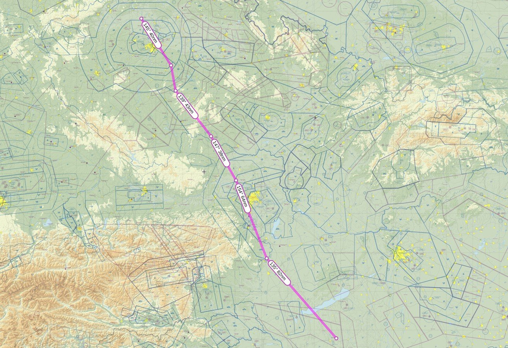

Вылет был назначен на 8 утра, погода по маршруту была хорошая, кроме небольшой части между Австрией и Венгрией, поэтому полетели IFR.

Кстати, если обычно любая страна в Европе на карте IFR маршрутов выглядит исполосанной вдоль и поперек, то в Венгрии ничего такого нет, от слова совсем - есть только точки входа и выхода, а между ними летишь просто напрямую

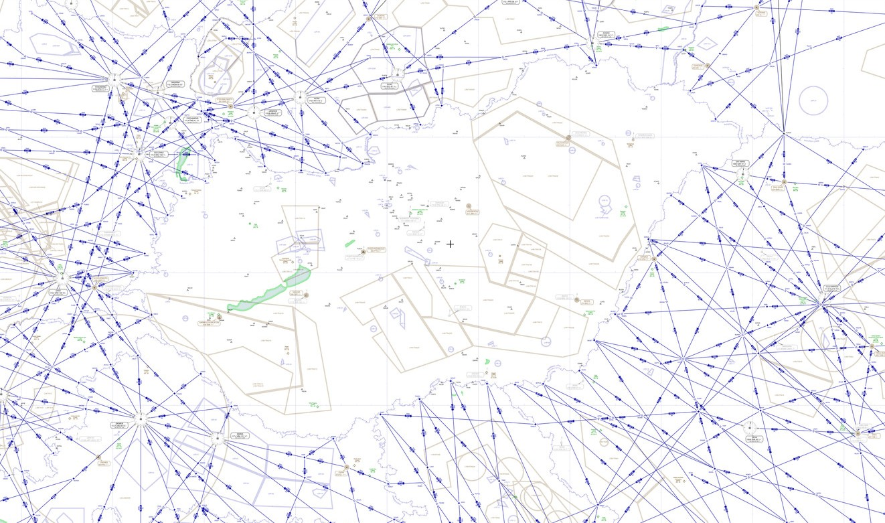

И так, взлет, переходим на Prague Information, активируем флайт план и берем курс на TIPRU.

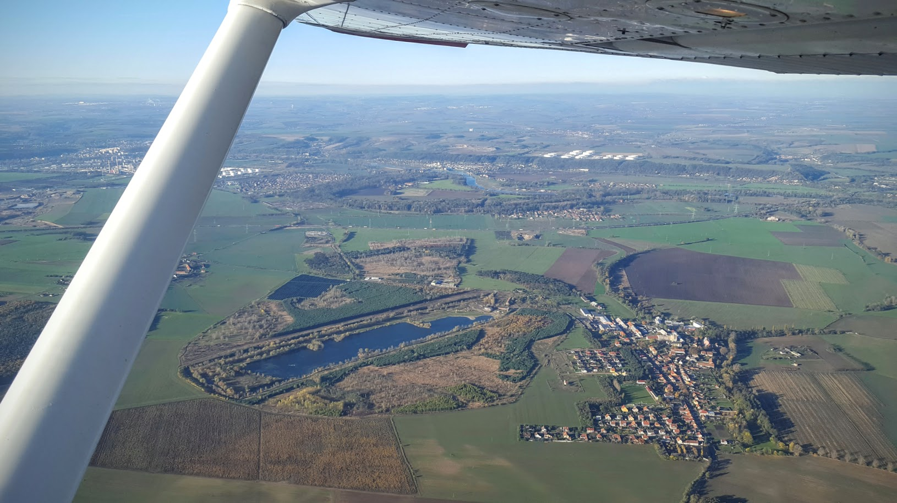

Через пару минут нас переводят на Prague Radar и дают набор FL70. Пролетаем военный аэродром Кбелы и соседний Летняны. Так как эти два аэродрома находятся бок о бок, и бетонка очень сильно выделяется, то было уже пару случаев, когда неподготовленные пилоты, летевшие сюда в первый раз, садились на военный аэродром вместо гражданского.

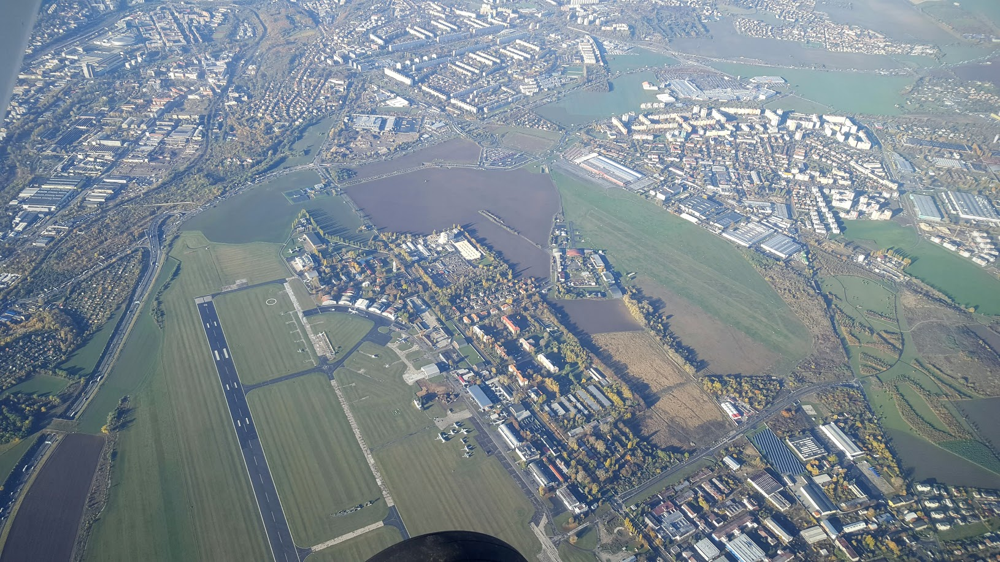

Прага.

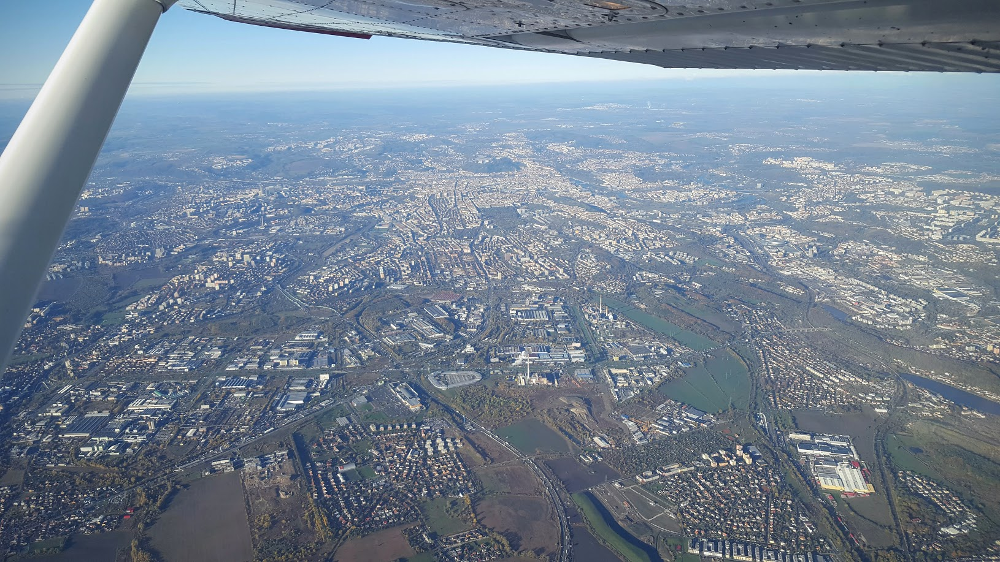

Набрали FL70

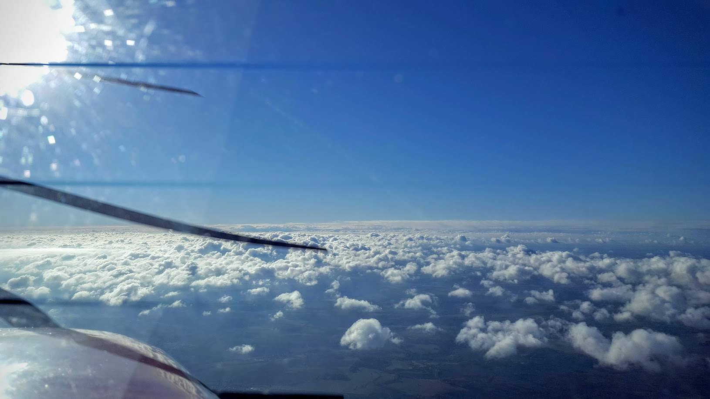

При подлете к STO (Stockerau), чуть западнее Вены и прямо над Дунаем нас встречают кучевки. Решаем набирать 9 000 и обходить справа. Диспетчер предупредил, чтобы сильно вправо не лезли в закрытую зону - там у военных стрельбы проходят.

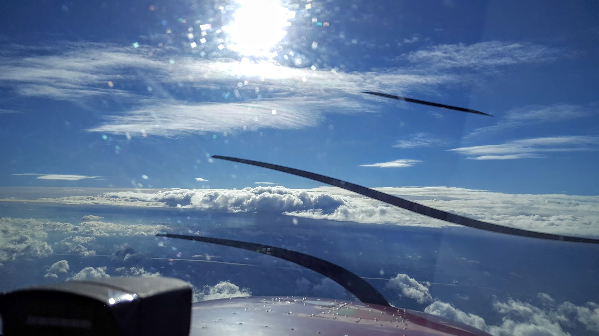

Подходим еще ближе, запрашиваем 10 000. Воздушная скорость у нас 120 узлов, а относительно земли  GPS показывает все 160.

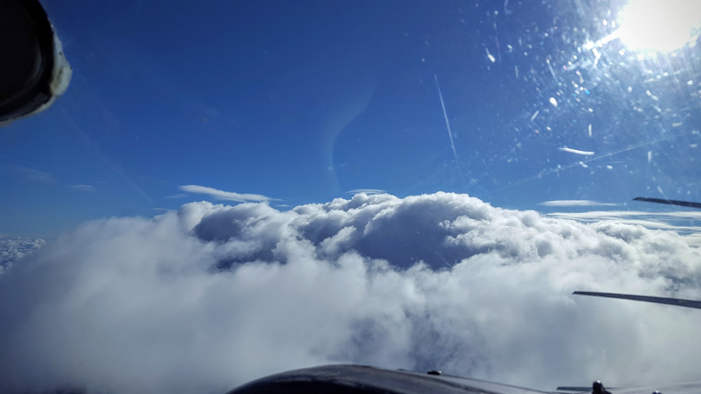

Проходим между облаками, стараясь сильно в них не залезать

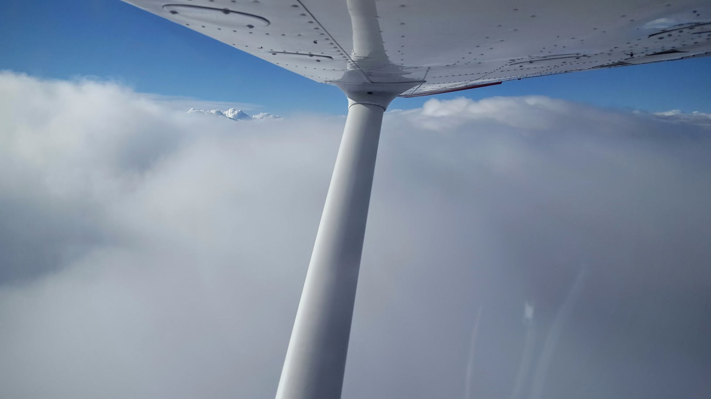

Так мы пролетели всю Австрию и частично Венгрию. Снижаться пришлось через облака

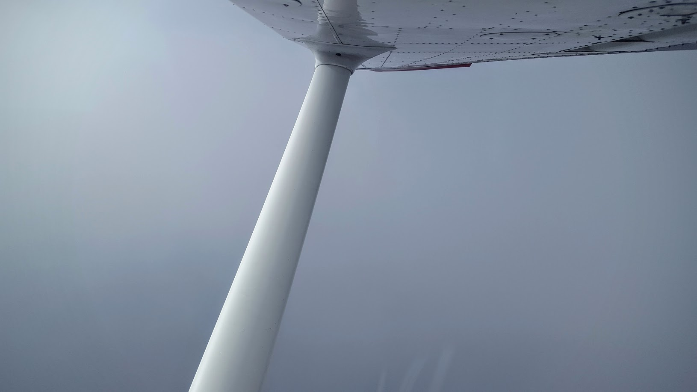

Где-то на 5 000 на схватываем небольшое обледенение. Еще через 1 000 футов выходим из облаков и влетаем в дождь, который смывает с нас весь лед.

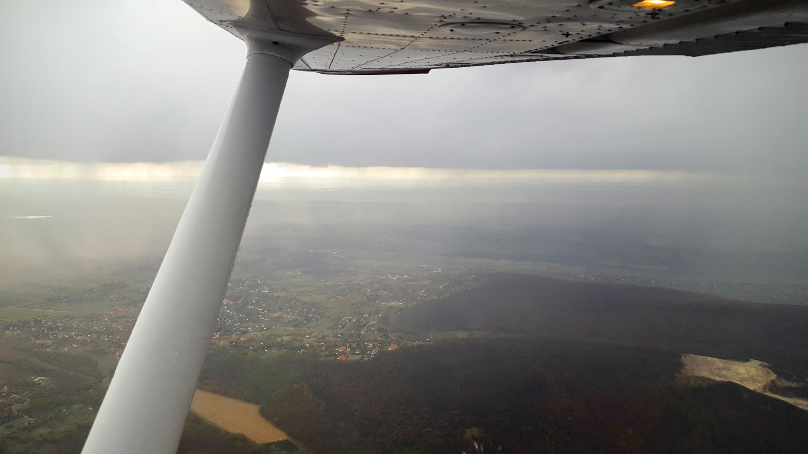

Ну и лонг файнал на полосу 17

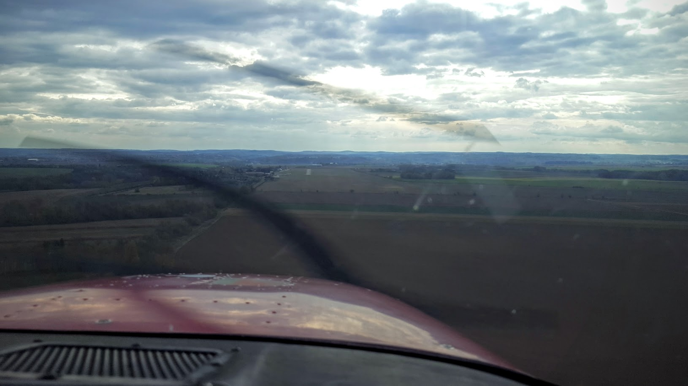

Садимся, заруливаем к ангару, где нас уже ждет бульдог. Честно говоря, аэродром выглядит как-то депрессивно, возможно из-за разобранных самолетов почти на всех стоянках.

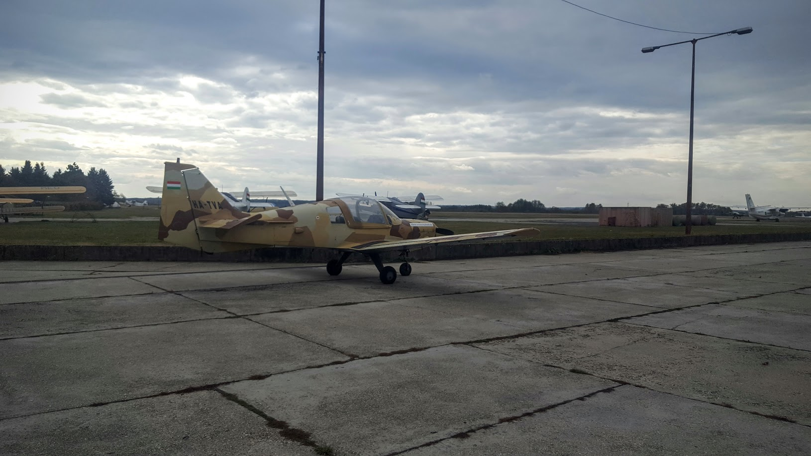

По плану вылет обратно у нас через час, но с севера начинает немного накрывать дождем, поэтому решаем немного ускориться.

Обратно планируем лететь уже по VFR через Словакию (LHKV ADAMA REKLU LKBA LKKA LKKB LKRO) - как раз должны облететь восточнее те кучевки, которые мы обходили над Австрией.

Вылетать приходится уже практически в дождь. Первым взлетает бульдог разведать обстановку и сделать тестовый полет по кругу, я пока рулю на предварительный. Видимость около 5 км, но с бульдога сообщают о просвете прямо по нашему маршруту. Ок, выхожу бэктреком на исполнительный и взлетаю. Набираю 1 500 футов и иду в сторону просвета, чувствуется, как дождь хлестает по стеклу и крыльям. И тут буквально через каких-то пару секунд

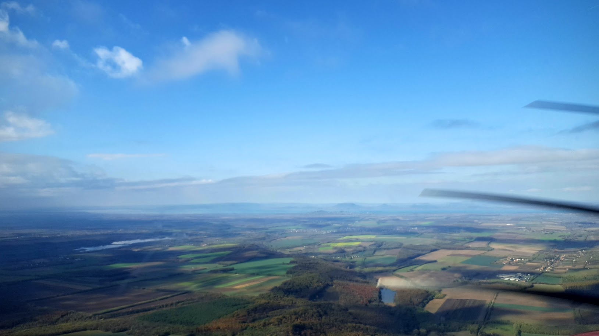

Чисто, CAVOK и даже ни намека на дождь. Следом за мной вылетает из дождя бульдог, мы выходим на Budapest Infromation, активируем план и берем курс на ADAMA - прямо на границу со Словакией.

Маршрут у нас получился через еще один военный аэродром. Я думал, что венгры заставят обходить, но дисп перевел нас на военных, а те просто дали "Crossing airfield approved, report 1 minute before leaving CTR". Клева, так и прошли над ними. Я поднялся на высоту 3 500, а бульдог полетел на 2 500.

При подходе к границе, примерно за 5 миль, нас перевели на Stefanik Control. Там дисп сказал выполнить разворот на 360 градусов, т.к. у него борт выполнял какие-то маневры прямо перед нами.

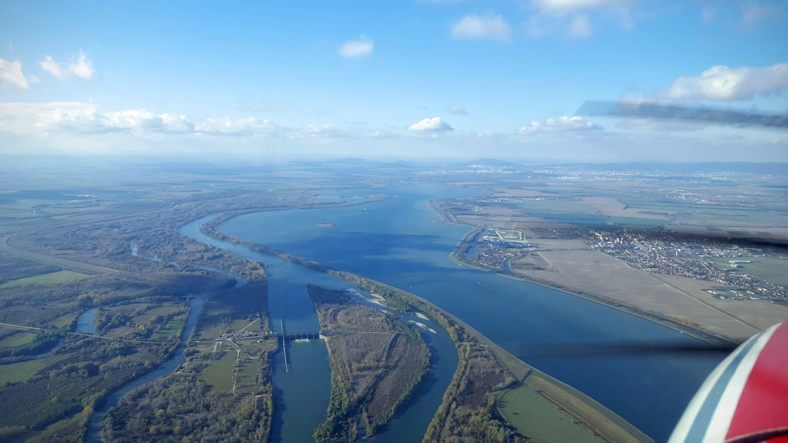

И над самой Братиславой еще дал несколько векторений из-за взлетающих бортов.

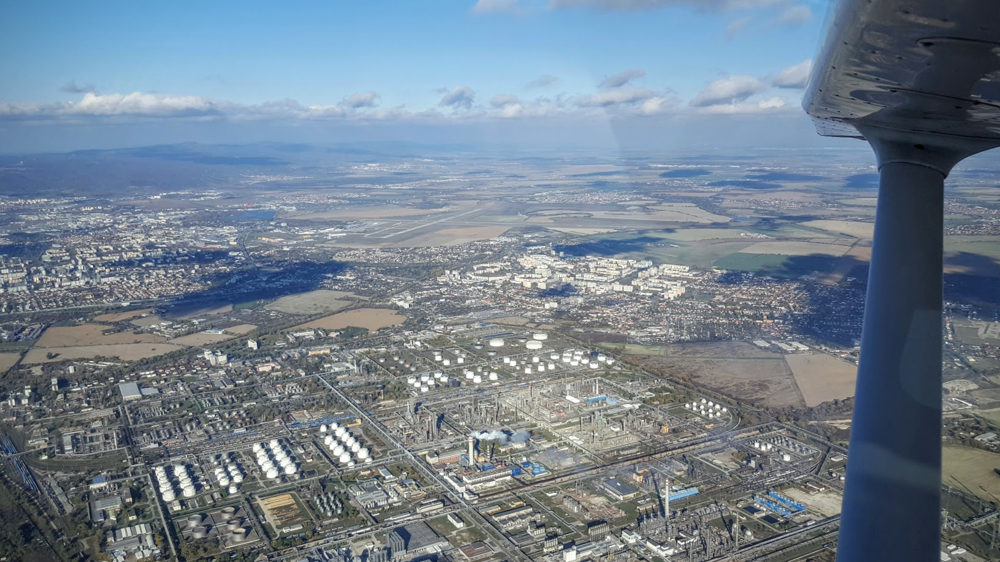

Дальше практически ничего интересного не было, чистый VFR, так слегка надоедали встречные порывы до 20 узлов. Перед Брно бульдог сел на одном из местных аэродромов на дозаправку - почти 50 литров в час жрет эта самолетка.

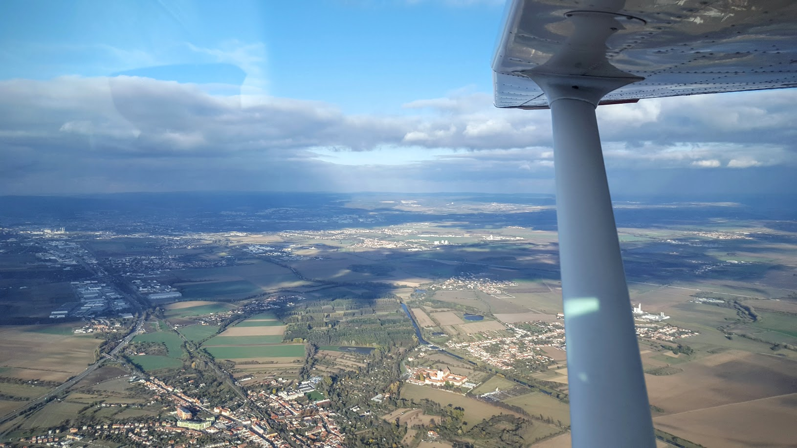

Перед Кбелами меня снизили до 2 000 футов, дали проход через Uniform и Mike и от туда прямиком на Роуднице. Зашел практически с прямой, сел, освободил полосу, зарулил на стоянку и выключил двигатель. На этом полет закончился, почти 5 часов в воздухе.

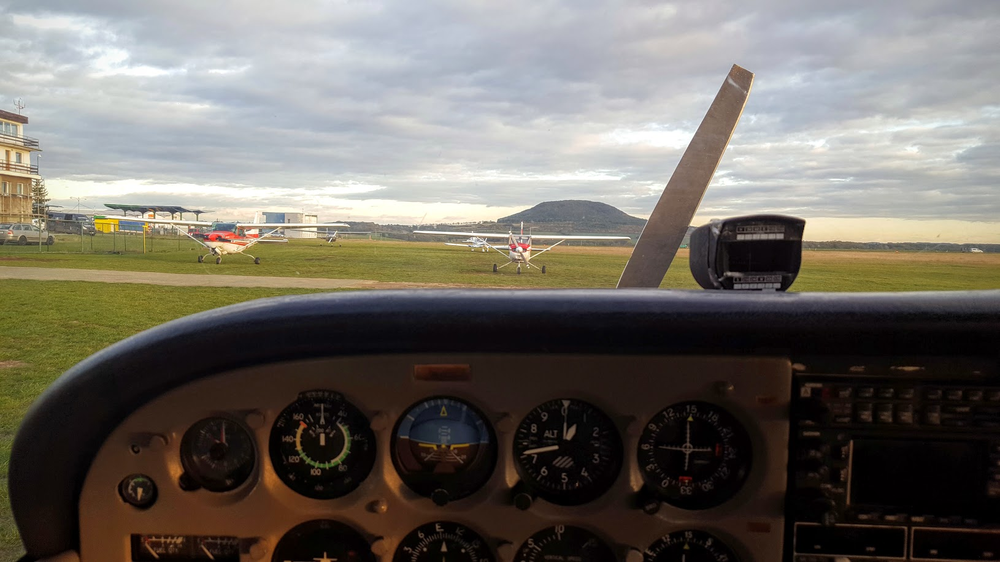