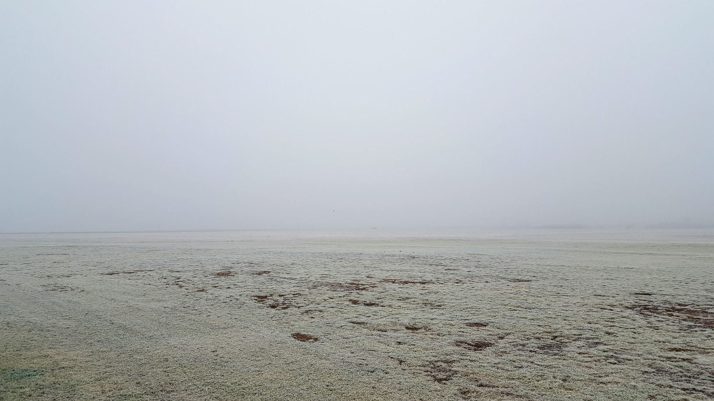
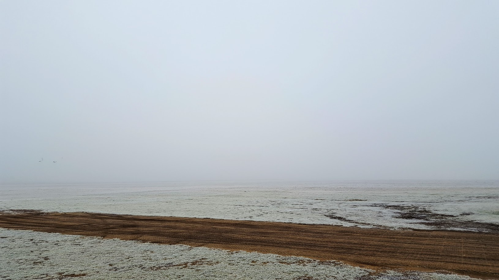
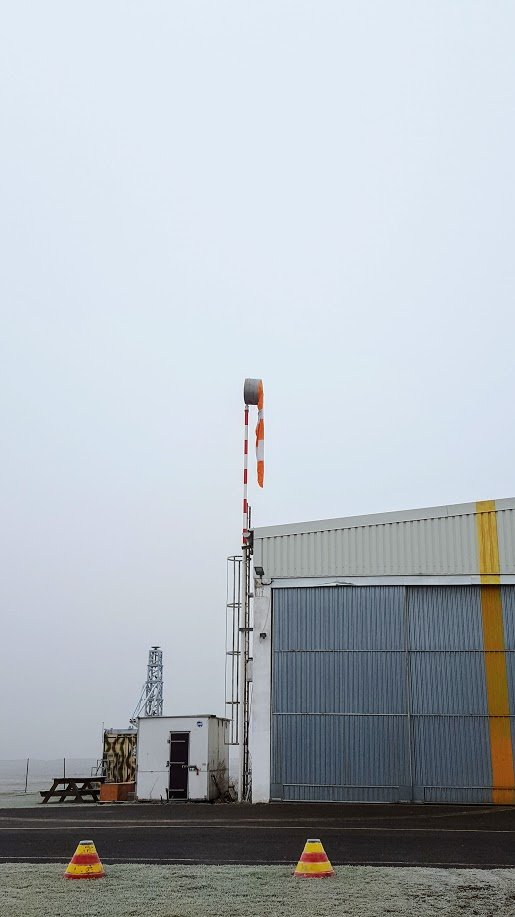

# Из последнего

Вы не поверите, но я все еще пытаюсь сдать на инструкторский рейтинг. В последний раз мне назначили скилл-тест на 30 декабря. И это уже третий или даже четвертый раз, когда по всем прогнозам от Пражского аэродрома LKPR должен быть CAVOK, а я приезжаю в Роуднице и там…

И вот так обратным курсом R31

Видимость колеблется от 50 до 100 метров, нижний край облачности не выше 100 футов. Ветра нет от слова совсем

