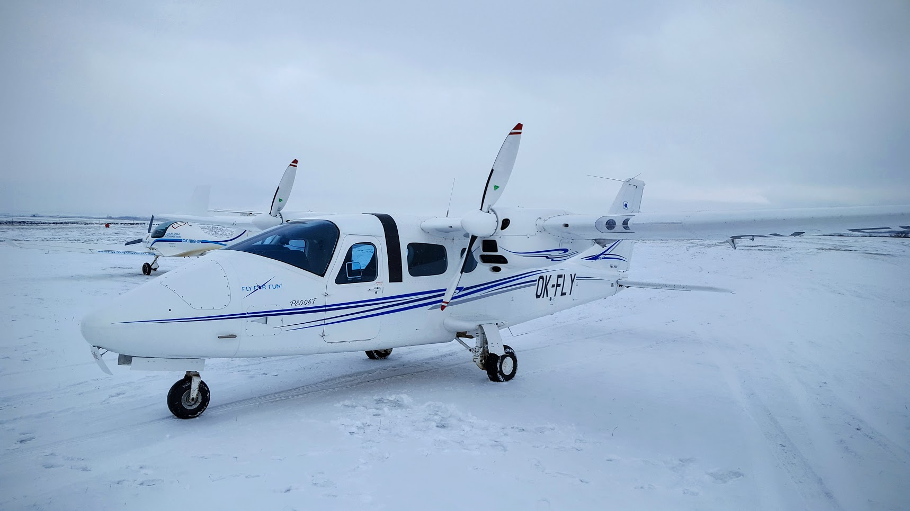
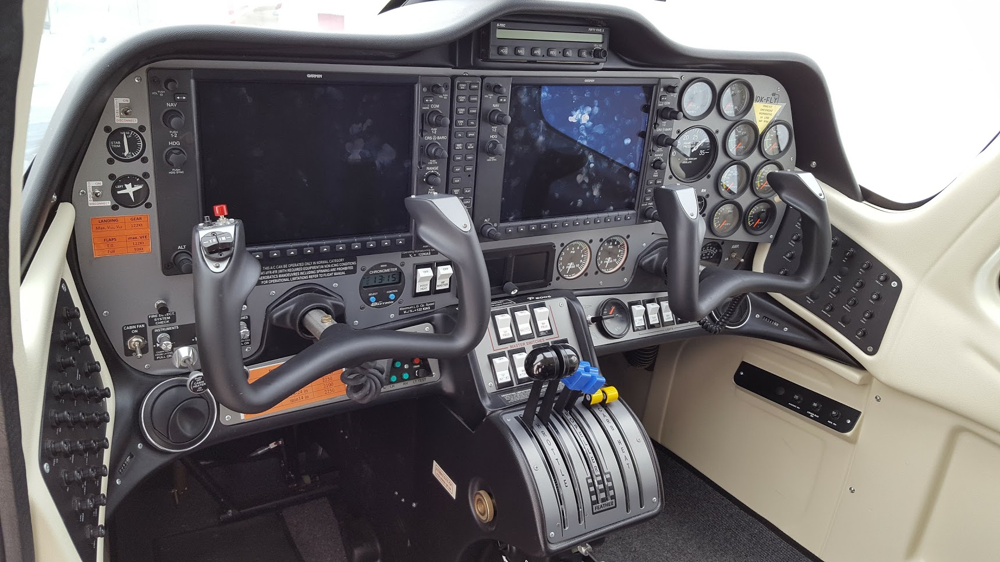
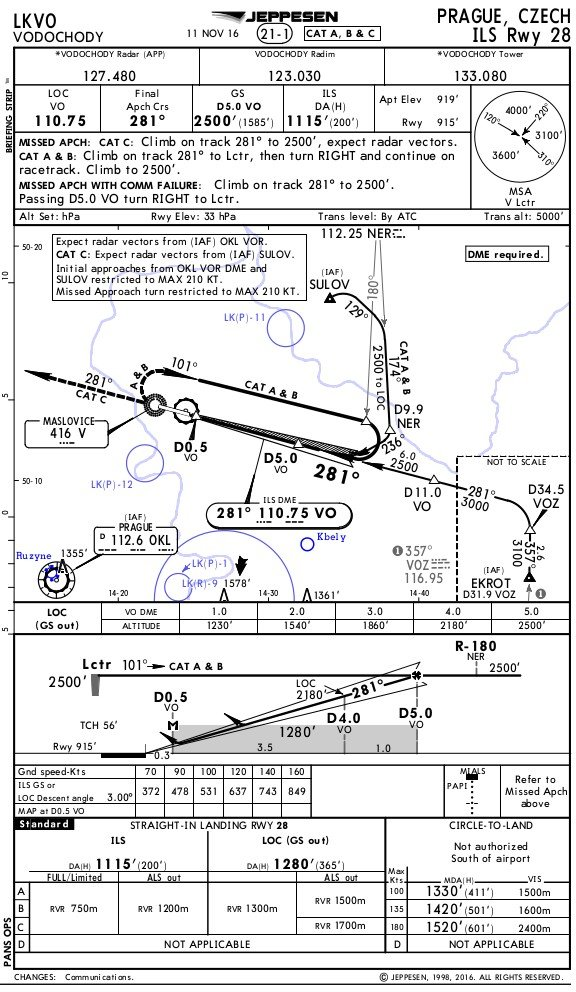
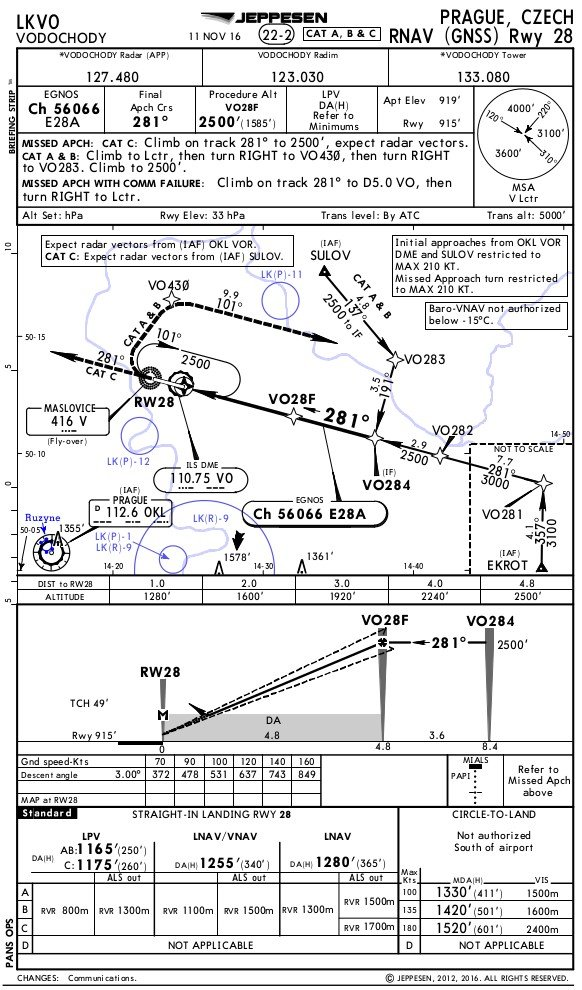
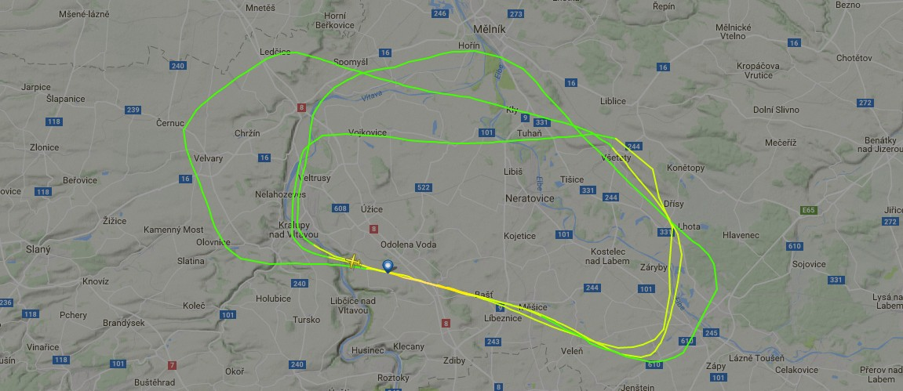

# MEP/IR

Мой тайп рейтинг на Боинг 737 истек в январе прошлого года, а вместе с ним и IR (Instrument Rating - полеты по приборам). То есть я уже год как VFR only пилот. Но и это еще не все - допуск на обычные многодвигательные (MEP) у меня закончился в 2014 и этим летом испарился бы совсем. В общем, надо было что-то делать.

<!-- more -->
Я уже упоминал, что в авиашколе FlyForFun вместо Morava L-200 появился новый Tecnam P2006T за вполне приличную стоимость летного часа. Но когда закончился срок действия IR в лицензии, нельзя просто так придти, сделать пару кругов и пойти сдавать скилл-тест. Авиашкола должна была послать программу обновления в САА специально под меня, а САА должен был это все утвердить. В итоге мне прописали 1.5 часа VFR полетов и 1.5 часа IFR, из них 1 час только с одним двигателем.

Через какое-то время я приехал на Сазену, и там меня ждала вот такая самолетка

Максимальная взлетная масса - 1230 кг, масса пустого - 760, т.е. на борт можно взять 470 кг с учетом топлива. Двигатели - Rotax 912S, по 100 л.с., пропеллеры с постоянными оборотами. На одном двигателе по мануалу вертикальная скорость 350 футов. Объем баков по 100 литров, расход - 36 л/час. Средняя скорость 120-130 узлов. Кстати, на заднем плане ультралайт точно с таким же двигателем - представляете сколько в нем дури?

Внутри тоже все красиво

Glass-cockpit на базе Garmin 960, что практически то же самое, что и G1000, но кнопки управления автопилотом вынесены на отдельную панель. Автопилот тоже стандартный для таких компоновок - HDG, NAV, APP, V/S. Автотротла нет, поэтому в режиме V/S при наборе нужно следить за скоростью (за ней вообще всегда нужно смотреть). Трим электрический на штурвале, плюс механическое колесо между сиденьями. Еще есть трим руля направления (раньше не встречал на самолетах такого класса). Конкретно этот вариант без анти-айса, поэтому обледенение лучше не схватывать, иначе можно услышать интересное биение по корпусу льда, слетающего с пропеллеров.

В полете тоже все хорошо, самолетка ведет себя стабильно. На одном двигателе скорость со 120-130 узлов падает до 90. Сваливается на ~55 узлах (в таком режиме заваливает немного влево), хотя предупреждения на экране и пищалки начинаются еще на 70. Приземления несложные, за счет верхнего расположения крыльев граунд эффект почти не ощущается, садится там же, где и наметил.

В общем, очень приятный в управлении самолет. Скилл-тест мне назначили через пару дней в Водоходах (LKVO).

Первый заход был ILS28

На аэродроме в это время были еще тестовые полеты трех истребителей L-159, поэтому на точку SULOV меня постоянно векторили. Сам заход достаточно простой: с SULOV курсом 129 ловим радиал 174 от NER, потом на расстоянии 9.9 мили поворачиваем вправо курсом 236 и ловим локалайзер. Выпускаем шасси, закрылки в 10. На 5й миле ловим глиссаду, на 3й довыпускаем закрылки.

Второй заход тоже был ILS28, но на одном двигателе. Все то же самое, только закрылки в 10 и шасси выпускаются уже на 3й миле. Уход на второй круг тоже был на одном двигателе.

Третий заход - RNAV28

Тут еще проще - просто летишь по GPS, процедуры те же самые. Единственное, удаления уже смотришь по GPS, а не настроенным как бэкап ILS и VOR NER (не знаю почему, но на этом постоянно кто-то валится на экзамене)

В итоге получилось вот такое

Обновленный MEP/IR экзаменатор вписал мне в лицензию сразу же после дебрифинга. Теперь у меня опять стандартный джентельменский набор рейтингов - SEP/MEP/IR (ну и просроченный B737 300-900)