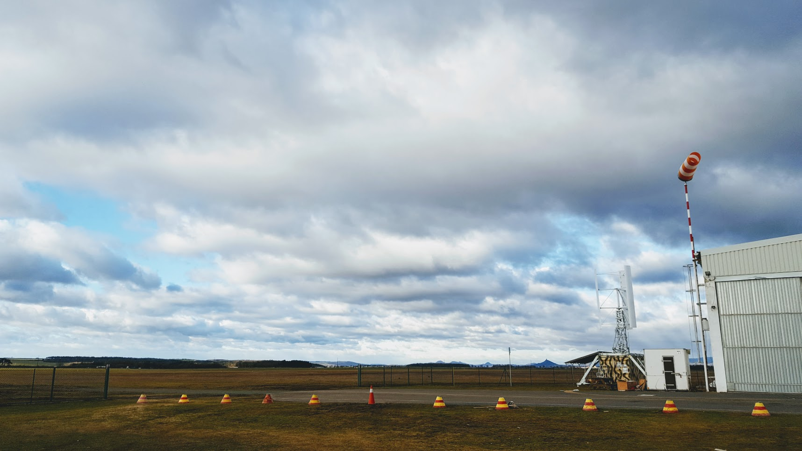
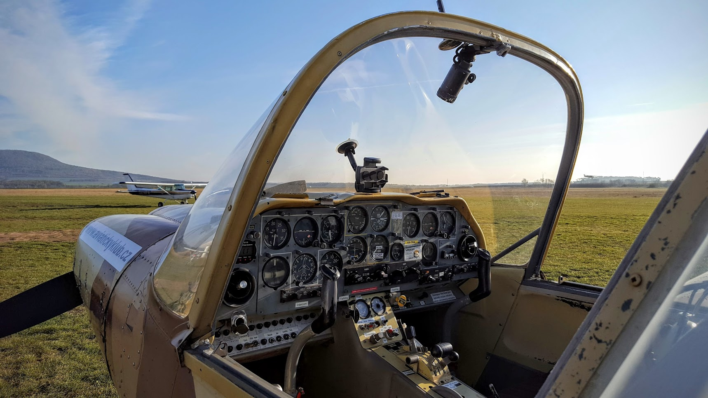
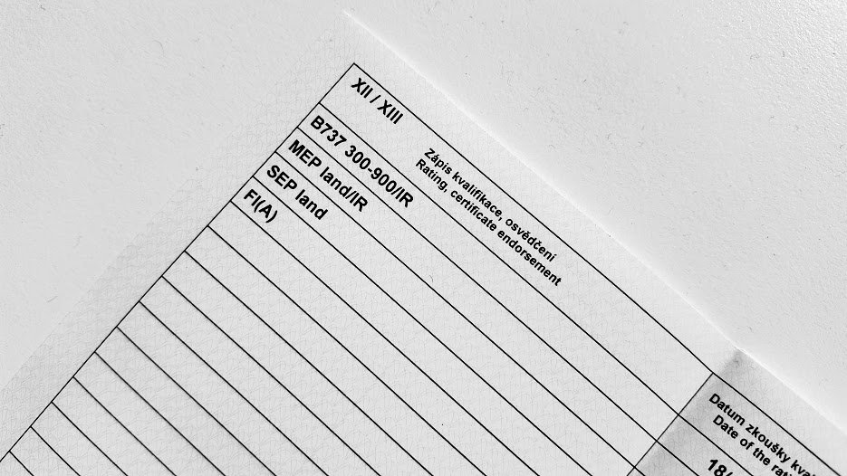

# Инструкторский

Буквально пару недель назад погода в Праге переключилась в весенний режим, и у меня появилось "окно" для сдачи скилл-теста на инструктора. Это окно немного появлялось и раньше в виде отличной видимости и высоких облаков...

<!-- more -->

...но если приглядеться к "носку", то можно заметить, что он "висит" параллельно земле. В тот день ветер был под 30 узлов с порывами до 44. В таких условиях не то, что акробатику не покрутишь, машину на шоссе сдувало.

Итак, настал час Х, когда и погода сошлась, и экзаменатор был свободен, и самолет был готов. На брифинге план по упражнения был такой: обычное приземление в стандартной конфигурации и без закрылков, экстренная посадка, вынужденная посадка, штопоры, форвард-слипы, ну и может быть что-то еще по настроению.

Так как нужно крутить штопоры, а это элемент акробатики, то самолет должен быть тоже акробатический. В моем случае это был Buldog SK-61.

Как я уже писал, скилл-тест на инструктора проходит так, что сам экзаменатор сидит слева в качестве "студента", а сам экзаменуемый сидит справа, как если бы выполнял функции инструктора. Плюс необходимо комментировать все свои действия, как если бы студент только-только сел в самолет, у него большие глаза и он вообще не понимает, что происходит.

Любое свое действие - потянулся я к тумблеру, нажал на тормоза, посмотрел по сторонам, дернул штурвалом - все нужно комментировать.

Приземление в стандартной посадочной конфигурации - тут никаких проблем, самая обычная посадка. Дальше мы поднялись на высоту 500 метров над полосой, экзаменатор перевел двигатель в idle-режим - имитация экстренного приземления. Тоже просто, самолет не кирпич, выдерживаешь скорость и летишь.

Штопоры. Набираем 5000 футов (примерно 1300 метров над аэродромом). Нужно выполнить сваливание, отсчитать два оборота и вывести самолет в нормальный режим. Ну как и во время обучения - двигатель на idle, скорость падает до 110 км/час, правую педаль до упора, через мгновение ручку полностью на себя - уехххууууууу, раз оборот, два оборот, ручку от себя, левую ногу вперед, выравнивание, понемного штурвал на себя и даем режим. Скорость в нижней точке 250-260 км/час, перегрузка 4g, потеря высоты около 100-150 метров на оборот + еще около 100 на выход. И так пару раз.

Потом был форвад-слип (скольжение на крыло). Используется, когда вдруг оказался высоко на полосой и нужно быстро потерять высоту. В основном применяется на маленьких самолетах, но и боинги тоже так могут (Планер Гимли). В этом случае одна из педалей до упора, штурвал в противоположное положение. Ничего сложного, но нужно помнить, что это упражнение выполняется всегда в посадочной конфигурации с полными закрылками. Но вот те, кто летает на цесснах, обычно это забывают, т.к. на них форвад-слип не рекомендуется (на некоторых моделях даже запрещено) делать с выпущенными закрылками.

Ну и вынужденное приземление - это когда ты подбираешь площадку (поле, дорога), делаешь облет и садишься.

Все, если все успешно прошло, через пару дней можно ехать в CAA и вписывать себе FI(A) рейтинг в лицензию.

Первые 100 часов мой FI будет Restricted - выпускать в соло студентов могу только с разрешения старшего инструктора, а так почти все то же самое. В общем, через несколько дней я уже стою в расписании в качестве инструктора на PPL.