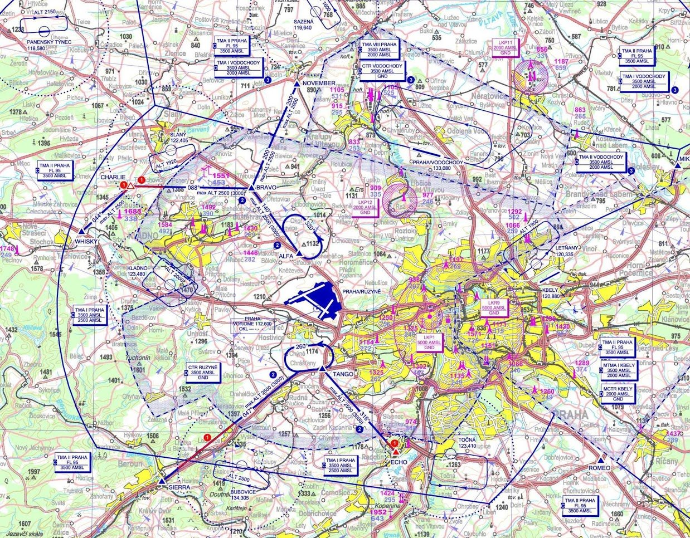
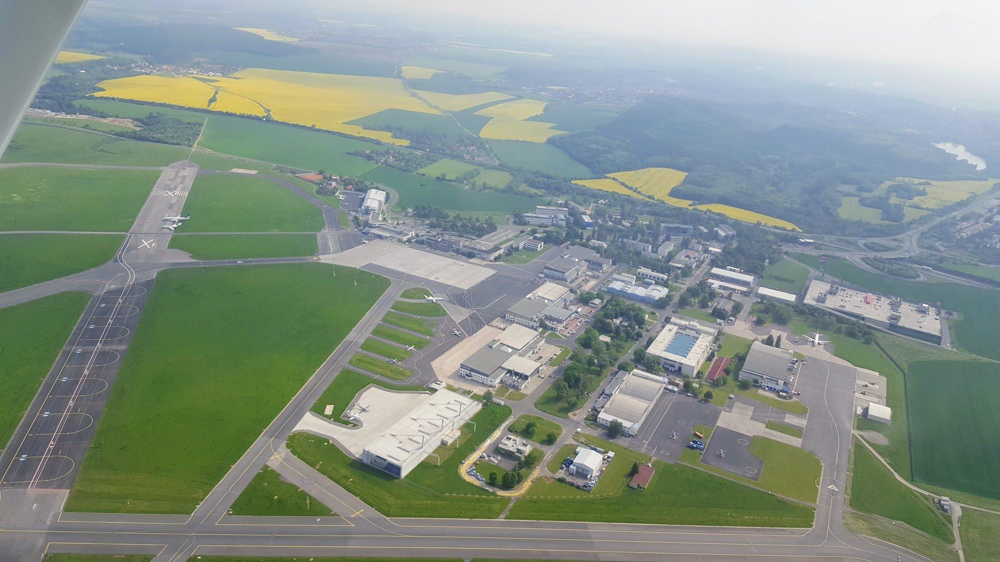
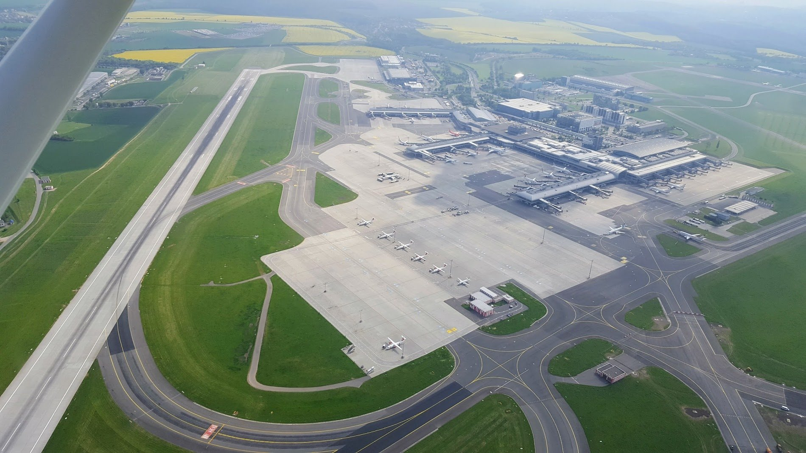

# Контролируемые пространства

Во время обучения на PPL студенты выполняют очень много различных упражнений, начиная от обычного полета в горизонте и вплоть до отработки посадки при отказе двигателя. Oдно из них - полет в контролируемые пространства. В этот раз мы летели из Прибрама на север через Пражский CTR.

В Праге (как и в любом крупном аэропорту) есть стандартные точки, обозначенные на схеме, через которые должен проходить VFR маршрут.

<!-- more -->

Полет запланировали по точкам Sierra -> Tango -> Alfa -> Bravo -> November. Часть маршрута Sierra -> Tango называется еще Sierra 2 Arrival, a Alfa -> Bravo -> November имеет "стандартное" название November 2 Departure. Выглядит это немного "скучно", но вот эти "стандартные" штуки нужно знать, т.к. диспетчер может дать пролет через зону, перечислив просто названия точек, а может сказать "You’re cleared for Sierra Arrival".

Кстати, то, что мы запланировали этот маршрут, еще не значит, что нас туда пустят - зависит от траффика в районе аэропорта, вылетающих и заходящих бортов, т.е. все на усмотрение диспетчера. Бывало и так, что просили облететь вокруг.

Перед точкой входа Sierra мы связались с Ruzyne Radar, они нам дали разрешение на пролет до точки Tango. Там нас перевели на Ruzyne Tower, который уже дал пролет по полосе 30 и дальше на Alfa. А там мы ушли опять на связь с Radar и продолжили полет дальше.

А вот так это выглядело из кокпита С150: в правой части фото торговый центр Шестка с парковкой на крыше, откуда можно "споттить" самолеты, а в центре слева - Терминал 3 для бизнес-джетов и частной авиации.

Пересекаем полосу 24/06, Терминал 1/2 на заднем плане и ЧСАшные самолеты АТР42/72 на переднем.
