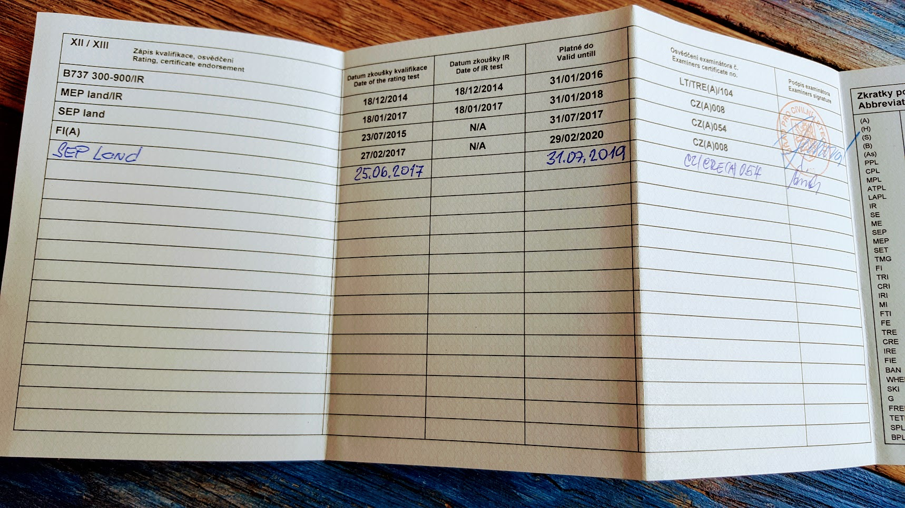

# SEP

Даже если ты инструктор и учишь летать на однодвигательных самолетах, тебе все равно нужно обновлять SEP (Single Engine Piston) рейтинг с экзаменатором. В моем случае на это ушло 10 минут на заполнение формы в САА, т.к. мой налет за последний год составил больше необходимого минимума в 12 часов (если быть точнее, то 70+).