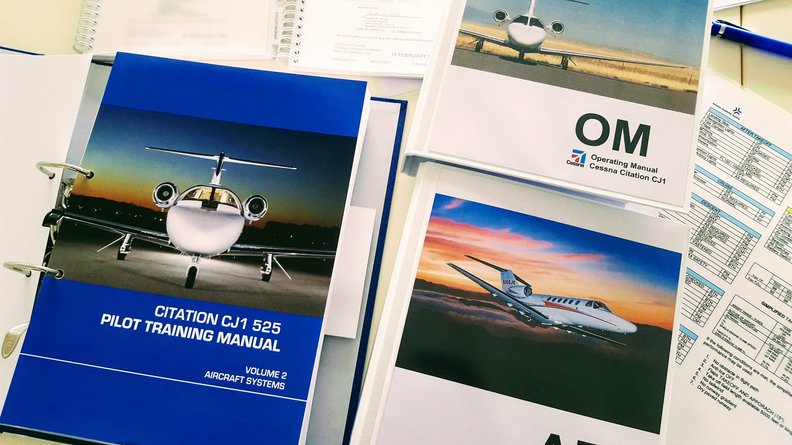
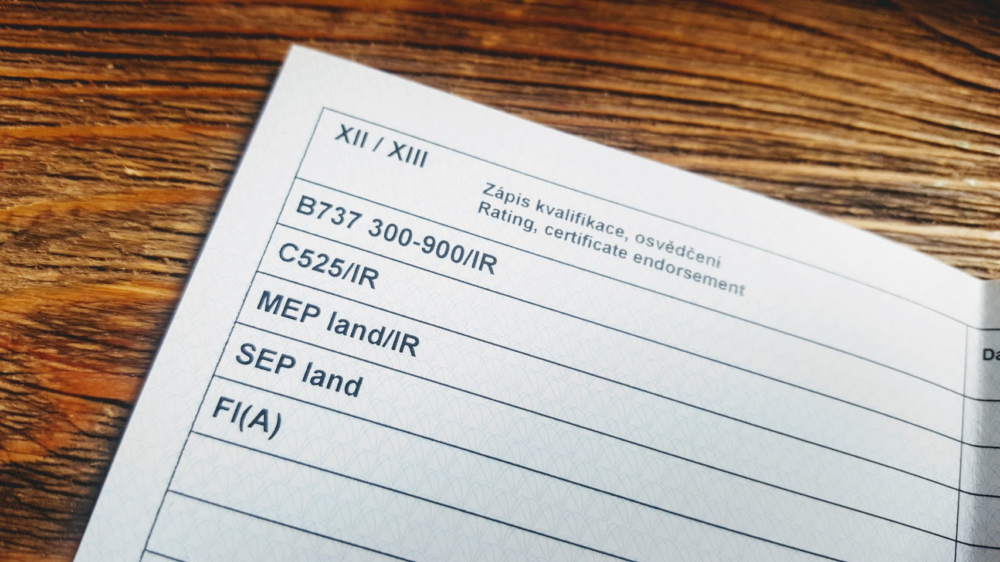
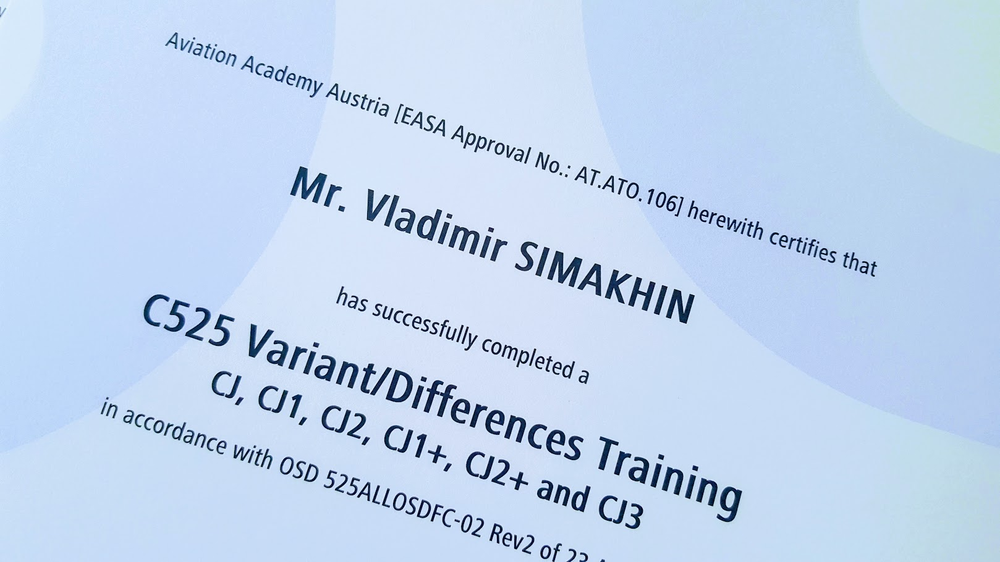
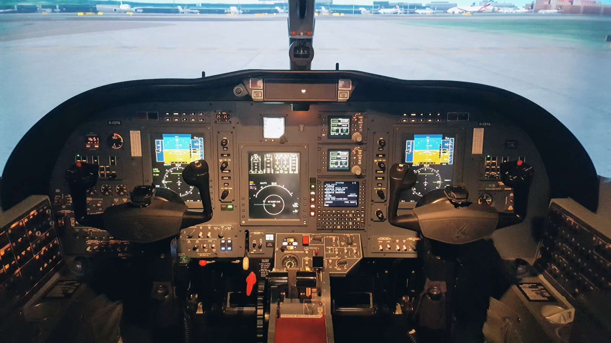
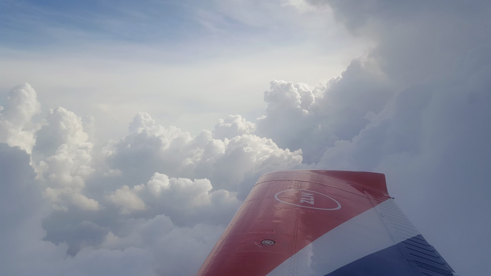
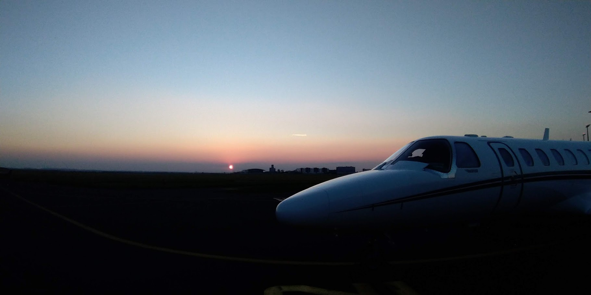

# Cessna Citation Jet

Пару месяцев назад я оказался в небольшом городке Bad Voslau в Австрии, недалеко от Вены. У этого городка есть свой одноименный аэродром (LOAV), на территории которого расположена Austrian Aviation Academy. В самой академии куча курсов, но конкретно меня интересовал тайп рейтинг на C525.

<!-- more -->

Сам курс как всегда состоит из теории и практики. Теория длилась 5 дней, после чего было пару выходных и потом итоговый тест (не буду скромничать, я его сдал на 98%).  Список тем, которые мы проходили: Aircraft general, Electrical system, Hydralic system, Flight controls, Fuel system, Powerplant, Fire protection, Environmental system, Ice & rain protection, Landing gears & brakes, Pressurisation & oxygen system, Master warning systems, Lightning, Avionic, Flight planning, Mass & balance, Abnormal and emergency procedures, SOP, Flight profiles, Limitations. В принципе, стандартный набор тем практически на любом тайп рейтинге. Кстати, в отличие от тайпа на боинг 737,  где был курс CBT (Computer based Training), тут вся теория была в классе и велась инструкторами.

Дальше самое интересное - 8 сессий по 4 часа на симуляторе, где мы отрабатывали все возможные отказы систем, пожары и не самые обычные ситуации (к примеру, я попросил дополнительно попробовать отказ обоих двигателей)

Ну а в конце, как всегда, скилл тест - отказ двигателя до и после V1, сдвиг ветра на взлете, полет по маршруту (у меня был Линц - Грац), разгерметизация, заход по ILS (с директорами и без) и NDB, с уходом на второй круг на одном двигателе. Опять же, звучит страшно, но ничего такого сложного.

Потом у меня была аэродромка в Праге уже на реальном самолете. Скажу сразу, дури в самолетке хватает, летит резвее того же боинга. И особенно это чувствуется на взлете, когда, если держать по всем правилам V2+15, в небо можно легко уйти с набором в 4000 - 5000 футов в минуту.

Еще там же в Австрии я прошел дифференс курс почти на все модели С525

Чтобы было более понятно - Cessna Citation Jet C525 совершила первый полет в 1991 году и тогда просто называлась CJ. Потом на самолет поставили новые двигатели и поменяли авионику, и он стал называться CJ1. Потом его еще немного удлинили, и это стала модель CJ2. Опять поменяли двигатели и добавили кучу новых фишек, таких как FADEC - стали звать СJ2+. И так далее. Сейчас С525 состоит из 9 моделей - CJ, CJ1, CJ2, CJ1+, CJ2+, CJ3, CJ3+, CJ4, M2, и я могу летать на 6 из них. Для CJ3+ и M2 нужно будет пройти курс по новой авионике - там стоит Garmin 3000, а CJ4 - немного другая компоновка кабины. А так это все один и тот же самолет. Это как с боингом - тайп рейтинг B737 300-900 так же включает в себя 9 моделей, но я мог летать на 300/400/500, т.к. у меня не было допуска на NG и MAX.

Еще чуть позже у меня был Operator proficiency check и PBN допуск на тренажере в Дортмунде в Германии - опять всевозможные отказы и пожары, стандартый набор.

Кстати, до Дортмунда из Праги и обратно мы летели на небольшом 4х местном самолете Z143 (3 пилота в кабине, не на машине же ехать)

Отдельным этапом было получение нового разрешения на работу (новая компания, новая область), которое длилось чуть больше трех месяцев. Если айтишником я в легкую получал его за месяц, то тут было все по другому. Судя по всему я вообще первый пилот в Чехии из третьих стран, которому делали разрешение на работу. Министерство постоянно запрашивало разъяснения, к примеру, что такое летный час, что такое рабочее время и как их соотнести с минимальными 15 часами в неделю для иностранцев. Или как указать место работы - "кабина самолета" им не подходила. В общем, если вы найдете компанию, которая готова будет принять вас на работу, можете обращаться в агентуру so-ry.cz (все айтишные документы/разрешения мне делали через них тоже).

А дальше у меня был лайн-тренинг (ввод по нашему), знакомство со спецификой бизнес-авиации, лайн чек, и теперь я  - второй пилот.
