# Один день пилотом бизнес-авиации

Каждая компания бизнес-авиации может отличаться процедурами, самолетами, планированием и т.д. Не удивлюсь, если кто-то тут из летающих после прочтения скажет, что у них все по другому.

Я летаю капитаном на самолетке Cessna Citation Jet C525A/B/C. Это небольшой бизнес-джет на 6 пассажиров (максимум 7), максимальная дальность около 3500 км (плюс\минус), максимальный эшелон FL450 (~13.8 км).

Описанный полет/день, можно сказать, один из самых стандартных и простых, который состоит из одного лега. Бывает, что мы летаем 4-5 рейсов за день, иногда даже один из двигателей не глушим — описывать такой день пока что-то не хочется, лучше как-нибудь видео в таймлапсе попробую записать.

Где-то возможно "наврал" с таймингами, т.к. во время полета время не фиксировал и восстанавливал уже по памяти. Я не пытался описать все выполняемые процедуры, иначе бы этот пост вырос до неприличных размеров, а вкладку в браузере вы бы закрыли еще недочитав и до середины.

*Вся история возможно выдумана, все совпадения случайны и вообще все это происходило в параллельной вселенной.*

<!-- more -->

#### За пару дней до

Получаю сообщение, что меня назначили на новый рейс в Рим, все данные уже есть в нашей системе планирования. Еще через полчаса приходит смс-ка от моего второго пилота — все OFP (Operational Flight Plan) готовы, топливо плюс\минус посчитано, окончательный рассчет будет уже в день вылета.

Стоит отметить, что у нас в компании планированием полета (маршруты, OFP, флайт планы, топливо, запасные и т.д.) занимаются сами пилоты. Тот отдел Operations (опсы), которые в больших авиалиниях все это делают и выдают пилотам уже готовые документы, у нас занимается, в основном, получением слотов, PPR и пермитов (разрешения) и разруливанием различных нештатных ситуаций.

#### За день до

Рейс все еще в системе (бывает клиент может отменить полет и перед самим вылетом), поэтому можно забронировать отель. Не во всех компаниях бизнес-авиации, но в большинстве (из тех, что я знаю) отели бронят себе пилоты. Из плюсов — в зависимости от расписания, расположения аэродрома, каких-либо местных особенностей (топливо ждать пару часов) можно выбрать гостиницу либо рядом с аэропортом, либо в центре города и устроить себе пару экскурсий, либо где-нибудь вообще подальше от больших городов. Так как мы летим в Рим на несколько дней, то отель в этот раз берем в центре.

Вечером еще раз смотрю погоду, проверяю чарты, нотамы, делаю апдейт OFP и отправляю запрос нашей хендлинговой службе на заправку топливом. В крыльях с предыдущего полета оставалось 1240lbs топлива, мне понадобится 3200lbs. Путем несложных вычислений (с поправкой на ветер) получается, что нужно долить 1130 литров

Сам маршрут выглядит так
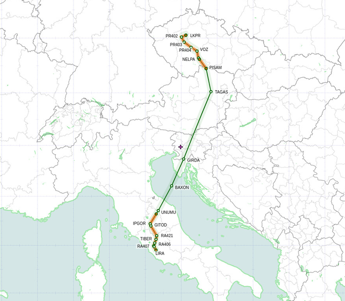

или в текстовом виде
```
VOZ Z21 PISAM DCT TAGAS DCT GIRDA DCT BAXON DCT UNUMU DCT IPGOR Y106 GITOD
```

#### День X

06:40 Получилось проснуться раньше будильника. Ок, встаю и иду умываться.

07:20 Завтрак и кофе. Параллельно проверяю почту и смотрю погоду, везде "экстремальные" условия CAVOK — видимость больше 10 км, без облаков, без гроз и т.д.

07:50 Пора ехать. На машине мне до аэродрома 25-30 мин, общественным транспортом получается около 1 часа.

08:30 В офисе. Пока прогревается кофе машина, можно подать флайт план. Для этого мы используем систему Arinc, в ней же и планируем все наши маршруты, она же нам считает все наши перформансы.

08:35 Приходит сообщение, что флайт план был изменен CFMU Amended. Это означает, что нам слегка поменяли маршрут. Ок, сверяем поданный
```
N0401F390 VOZ Z21 PISAM DCT TAGAS/N0404F380 DCT GIRDA DCT BAXON DCT UNUMU/N0407F370 N737 IPGOR Y106 GITOD
```

и полученный измененный
```
N0401F390 VOZ Z21 PISAM DCT TAGAS/N0404F380 DCT GIRDA DCT BAXON DCT UNUMU/N0407F370 DCT IPGOR Y106 GITOD
```

Разница в том, что нам поменяли трассу N737 на спрямление сразу на точку IPGOR. Круто, но по факту между UNUMU и IPGOR ничего нет, и эти точки находят на одной прямой.

08:40 Пришел мой второй пилот с которым я сегодня выполняю рейс. Обновляем наши iPad'ы — чарты, погода, нотамы и все, что касается полета.

08:50 Брифинг. Куда летим, как летим, что ожидается по маршруту, что интересного в нотамах, наиболее вероятные заходы в Риме (STAR и Approach), запасные аэродромы, в каком состоянии самолет по документам и т.д.

09:05 Готовим пакет документов, распечатываем, подписываем.

09:15 Теперь можно переодеться в униформу. У нас довольно необычная форма по сравнению с другими компаниями, она стилизована под форму Королевских ВВС времен второй мировой войны. Таким образом компания и ее владелец отдает дань чехословацким пилотам, которые сражались в Британии.

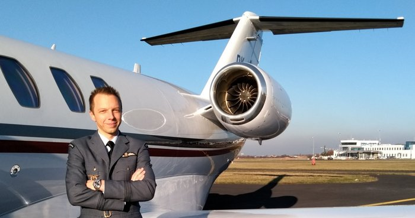

09:30 Все готово, можно идти на самолет.

09:35 Проходим через рамки и выходим на перрон. Самолетка стоит у бизнес терминала — метров 500 по прямой. Ок, звоним на хендлинг, чтобы нас отвезли.

09:40 Подъехали. Пора будить самолетку.

Наши процедуры в компании расписаны так, что второй пилот "работает" внутри, капитан — снаружи. Когда я летал вторым, на мне была подготовка систем самолета (забить фмску, взять диспетчерское разрешение), осмотр салона, подготовка кейтеринга (бокс с едой, горячая вода, лед, проверить, что на месте напитки, вино, пиво и т.д.). Сейчас капитаном на мне обход самолета, заправка, работа с хендлингом и клиентами. Если где-то нужно ускориться, то соответственно друг другу помогаем.

09:50 Заправка закончена
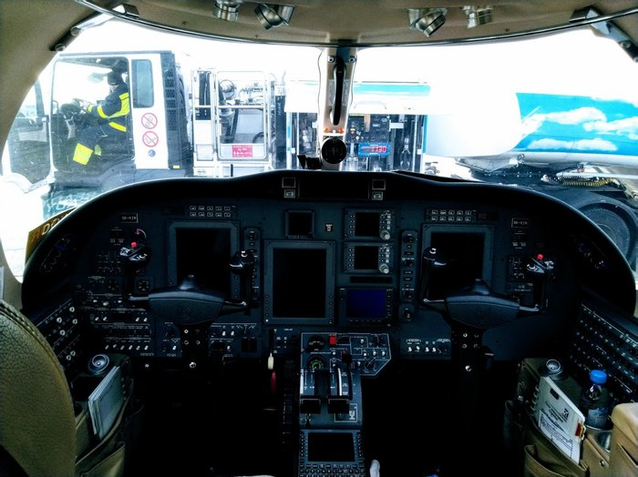

10:00 Осматриваю самолетку
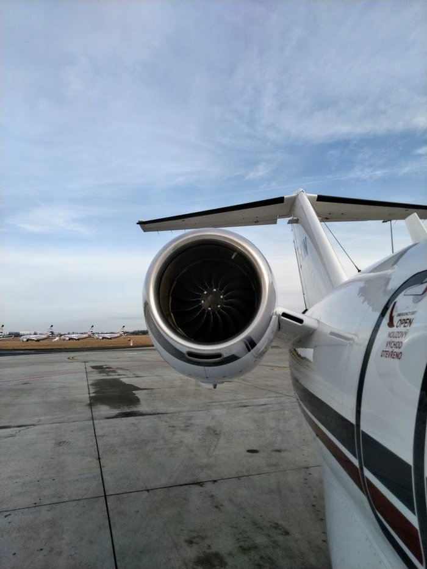

10:10 Все готово к вылету, осталось только дождаться пассажиров. Иду встречать их в терминал.

10:20 Подъехали 2 из 4. Пока они решили перекурить, отправляю багаж с хендлинг агентом на самолет. Пишу в мессенджере второму, чтобы принял чемоданы и запросил технический старт.

У нас небольшой самолет, в отличие от боингов и эирбасов у нас нет APU (ВСУ — вспомогательная силовая установка), которая бы нам давала воздух и электричество. Поэтому на земле, если нет GPU (Ground Power Unit), мы запрашиваем технический старт одного двигателя на холостых оборотах. В этом случае мы можем включить всю авионику, кондиционер и отопление.

10:30 Все в сборе, можно идти. Один из плюсов бизнес-авиации — вам не нужно стоять в очередях, от момента входа в здание терминала и до посадки в кресло проходит неприлично мало времени по сравнению с обычными авиалиниями.

10:35 В самолете, закрываю двери, второй пилот стартует второй двигатель. Провожу брифинг — сегодня мой коллега Pilot Flying, я буду Pilot Monitoring, полет займет 1 час 30 минут на высоте 39000 футов или почти 12 км, эвакуационные выходы здесь и здесь, маски в случае разгерметизации выпадут вот отсюда, так как летим немного над морем, то жилеты можно найти вот тут. А вообще подготовленный кейтеринг находится вот здесь (сегодня у нас офигенный набор канапе), охлажденное шампанское уже ждет не дождется, чтобы быть открытым, если вдруг захочется чего-то еще, то у нас на борту есть вино, пиво, виски и другие напитки прямо вот тут у вас в баре. Приятного полета :)

10:37 Сажусь к себе в кресло, надеваю наушники. Мой коллега вводит в курс дела — полоса, выход (SID), высоты и т.д. Ок, пора сделать Before Taxi Checklist

10:45 Запрашиваю руление.<br>
— Ground, dobrý den! DFC12B (Dark Blue 12 Bravo — наш позывной), stand S9, request taxi.<br>
— DFC12B, dobrý den, ground. You're cleared to taxi holding point runway 24 via taxiway P L H B, initially hold short of K.

Записываю в OFP R24 PLHB xK и делаю ридбек (повторяю то же самое, что мне и сказал диспетчер — делается для того, чтобы диспетчер удостоверился, что я принял сообщение, и принял его правильно)
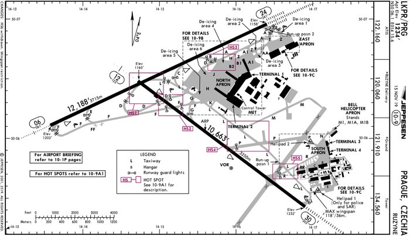

10:47 Выезжаем на рулежку L и второй пилот дает команду на Taxi Checklist

```
— Taxi lights — ON
— Brakes — Working
— Nosewheel — Steering
— Flaps — Set for departure, 15
— Flight Instruments — No red crosses, all good
— Flight controls — Checked, free and correct
— Crew briefing — Completed
```

10:48 Подъезжаем к рулежке K, у которой мы должны остановиться<br>
— DFC12B, ground, continue holding point runway 24 via H and B.<br>
— H, B, runway 24, DFC12B.

10:50 На рулежке B нас переводят на другую частоту<br>
— DFC12B, contact tower 134560. Ahoj!<br>
— 134560, diky, ahoj, DFC12B!

10:51 Настраиваю частоту вышки<br>
— Tower, DFC12B, dobrý den, taxiway B, fully ready upon reaching<br>
— DFC12B, dobrý den, hold short runway 24, traffic on short final<br>
— Holding short, DFC12B<br>

Останавливаемся перед полосой, ждем пока приземлившийся борт съедет с полосы, самолетка готова к взлету. Заодно можно прочитать Before Takeoff Checklist.
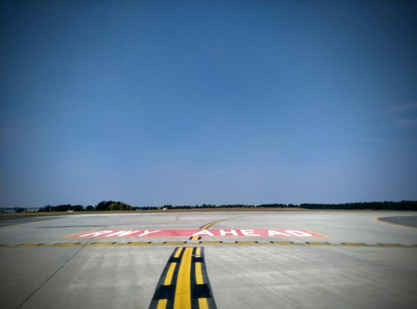

10:53<br>
— DFC12B, tower, line up runway 24, cleared for take off runway 24, wind 270/4<br>
— Cleared for take off runway 24, DFC12B, ahoj!

Оборачиваюсь к пассажирам, все готовы, кто-то даже приготовился снимать взлет на телефон — показываю большой палец — вперед!

10:54
Второй пилот двигает РУДы, двигатели выходят на 60%<br>
— Stabilized<br>
— Ok, setting take off thrust<br>

Проверяю, что двигатели вышли на взлетный режим, все показатели в норме<br>
— Take off thrust set, indications normal.<br>

Самолетка начинает разгон по полосе, тебя вжимает в кресло. На PFD (Primary Flight Display) отобразилась скорость 40 узлов<br>
— Speed alive!

Самолетка очень легкая, двигатели мощные, скорость набирается очень быстро<br>
— 70 knots!<br>
— Checked!<br>
— V1!<br>
— Checked!<br>

V1 скорость принятия решения. Пилот убирает руки с РУДов — теперь почти при любом отказе только вверх.

Проходим скорость поднятия носовой стойки<br>
— Vr!<br>
— Cheeecked!<br>

Коллега тянет штурвал на себя, самолетка отрывается от земли — еххуу, летим!<br>
— Positive rate<br>
— Gear up<br>

Убираю шасси, проверяю, что огни погасли<br>
— Gear up, no lights.<br>

— MCT, yaw dumper, vertical speed<br>
Ставлю режим двигателей на Maximum Climb Thrust, включаю Yam Dumper и выставляю вертикальный режим в Vertical Speed.

Проходим 2500 футов. Выставляю частоту Праги<br>
— Prague, DFC12B, dobrý den, passing 2500 ft<br>
— DFC12B Praha radar, radar contact, climb FL160, direct to VOZ<br>
— Climbing FL160, direct to VOZ, DFC12B<br>

Так как второй пилот все еще летит вручную, то я выставляю эшелон FL160 и в FMS даю спрямление на точку VOZ. Плюс переставляю давление на стандартное Q1013 на всех 3 высотомерах. Проходим 4000 футов, второй пилот дает команду Flaps Up, включить автопилот и After Take off Checklist.

10:55 Проходим 6000 футов, чеклисты выполнены, самолетка летит в автопилоте, все ок, продолжаем полет.

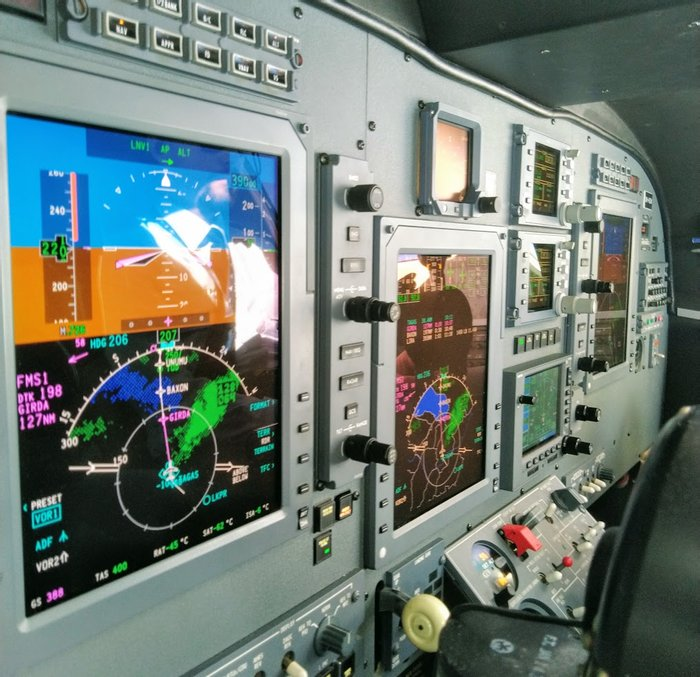

11:15 Набрали эшелон FL390, передаю радио второму пилоту и иду в салон узнать, как там пассажиры. Шампанское открыто, канапе потихоньку исчезает, все довольны.

11:30 Полет проходит спокойно, все параметры в норме, расход топлива по плану и даже чуть меньше. Можно забить в фмс-ку подход и полосу, чтобы она нам посчитала примерный TOD (Top of Descent).

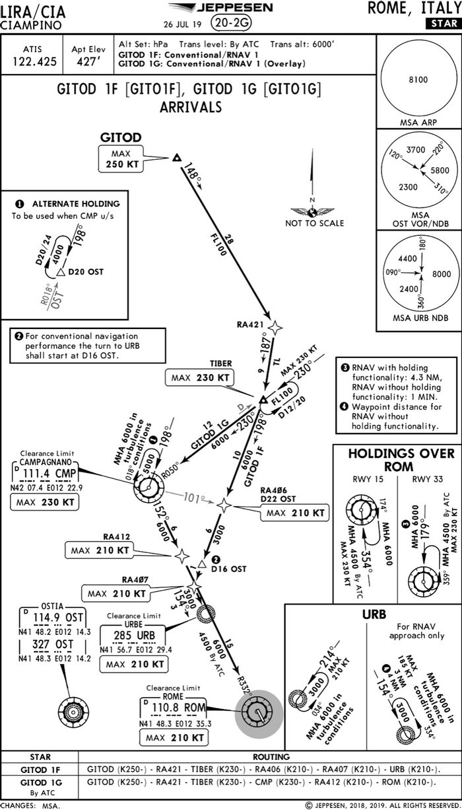

Мы идем через точку GITOD, поэтому STAR может быть GITOD 1F или GITOD 1G. По опыту полетов в Рим обычно давали 1F, плюс он короче, поэтому в фмс-ке выберем именно его.

Ну и судя по прогнозу полоса будет R15 и заход, опять же из опыта можно предположить, что будет ILS Z 15 с векторением.

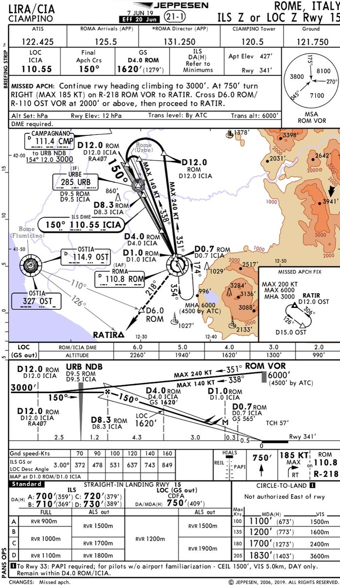

11:40 Итальянцы начали нас снижать чуть раньше запланированного TOD. Ок, поставим пока вертикальную -1000 ft/m

11:50 Передаю радио второму пилоту, сам переключаюсь на частоту ATIS, чтобы взять последнюю информацию по погоде

— This is Ciampino ATIS arrival and departure, information A, ILS Z in use, runway 15, wind touchdown zone 040/5, CAVOK, temperature 15, dew point 02, QNH 1026, you have received information A.

Супер, погода CAVOK, небольшой боковик, вбиваю данные в фмс — она нам считает посадочную дистанцию, массу и скорости.

11:55 Диспетчер дает нам снижение до FL150 и переводит на Rome Radar<br>
— Rome Radar, DFC12B, Buongiorno! Descending FL150 inboud GITOD.<br>
— DFC12B, Buongiorno (с хорошим итальянским акцентом). Direct GITOD, GITOD 1F, expect vectoring for ILS Z R15.<br>
— GITOD, GITOD 1F, vectoring ILS Z R15, DFC12B<br>

Как мы и предполагали — GITOD 1F и ILS Z R15

12:00 Второй пилот передает мне управление и начинает готовить самолет к посадке. Еще раз проверяет все введенные данные, настраивает частоты ILS, VOR, NDB, курсы и минимумы.

12:02 Передаю управление обратно и настраиваю то же самое на своей стороне. Пора проводить брифинг. Еще раз проверяем все настройки, частоты, минимумы, обговариваем уход на второй круг, минимальные высоты, начало снижения по глиссаде и т.д.

12:10 Диспетчер снижает нас до 6000 футов. Переставляем стандартное давление на Q1026, проверяем высотомеры — Approach Checklist

12:15<br>
— DFC12B, Rome Radar, descend 3000 ft, direct RA406, cleared for ILS Z R15<br>
— Descending 3000 ft, direct RA406, cleared for ILS Z R15, DFC12B<br>

Нам разрешили заход. Самолетка ловит локалайзер и глиссаду, скорость 200 узлов. Второй пилот отключает автопилот и переходит в ручное управление.<br>
— DFC12B, full established<br>
— Contact Ciampino Tower, 120.5, cau!<br>
— 120.5, grazie, cau!<br>

12:24<br>
— Tower, DFC12B, buongiorno! ILS Z R15 full established<br>
— DFC12B, tower, buongiorno. Cleared to land R15, wind 040/3<br>
— Cleared to land R15, DFC12B<br>

6 миль до полосы, пора начать выпускать закрылки.<br>
— Flaps Approach<br>
— Speed check, flaps approach set. Indicating.<br>

Скорость начинает снижаться до 180 узлов.

4 мили до полосы, выпускаем шасси.<br>
— Gear down<br>
— Speed check, gear down, 3 green<br>

Скорость снижается до 140 узлов

2 мили до полосы<br>
— Flaps land<br>
— Speed check, flaps land, indicating.<br>
— Final check list<br>

Скорость 120 узлов, 110, проходим высоту принятия решения, скорость 100 узлов, проходим торец полосы, высота 50 футов, скорость 95 узлов, высота 30 футов, 20, 10, выравнивание

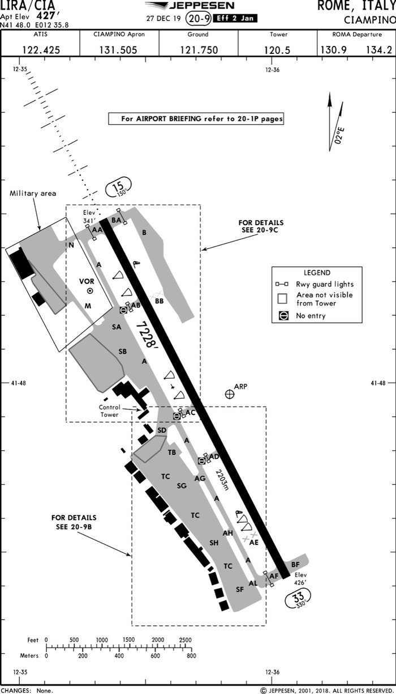

12:27 Касание, второй пилот опускает носовую стойку. Начинаем торможение, выпускаем закрылки в положение Ground, автоматически выпускаются спид-брейки.

— DFC12B, Tower, vacate right via AD, contact ground 121750.<br>
— Right AD, ground 121650, grazie, cau!<br>
— Ground, DFC12B, buongiorno, AD.<br>
— DFC12B, ground, buongiorno, right A, SD, stand 306.<br>
— A, SD, stand 306, DFC12B<br>

12:33 Все, мы на земле, выполняем After Landing процедуры и заруливаем на стоянку. Второй пилот выключает двигатели, я иду в салон.

— Добро пожаловать в Рим, температура 15 градусов, солнечно!

После того, как пассажиры вышли, нас буксируют на соседнюю стоянку

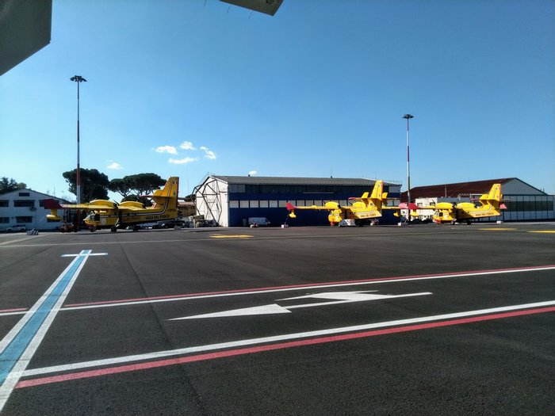

12:50 Звоню сейлзам, если нас вдруг не продали куда-нибудь еще — неа, остаемся в Риме. Теперь нам нужно заполнить документацию, немного прибраться, восполнить запасы напитков и шампанского, и уложить самолетку спать.

13:15 Все готово, звоним на хендлинг, чтобы нас отвезли в терминал и заказали нам такси до отеля.

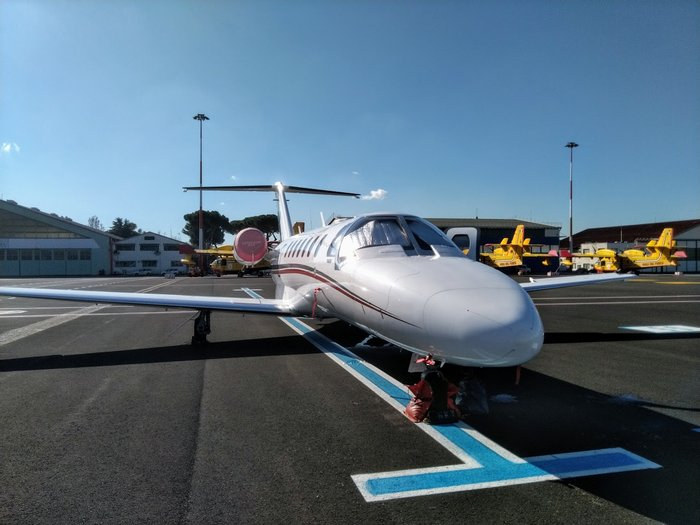

14:00 В отеле. Забиваю еще пару данных в наши внутренние системы отчетности. Все, рабочий день закончен.