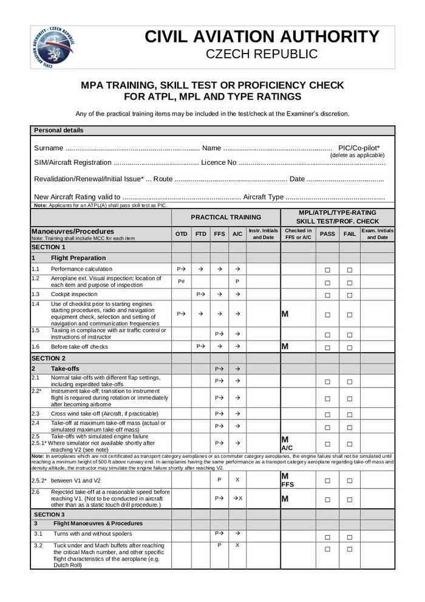
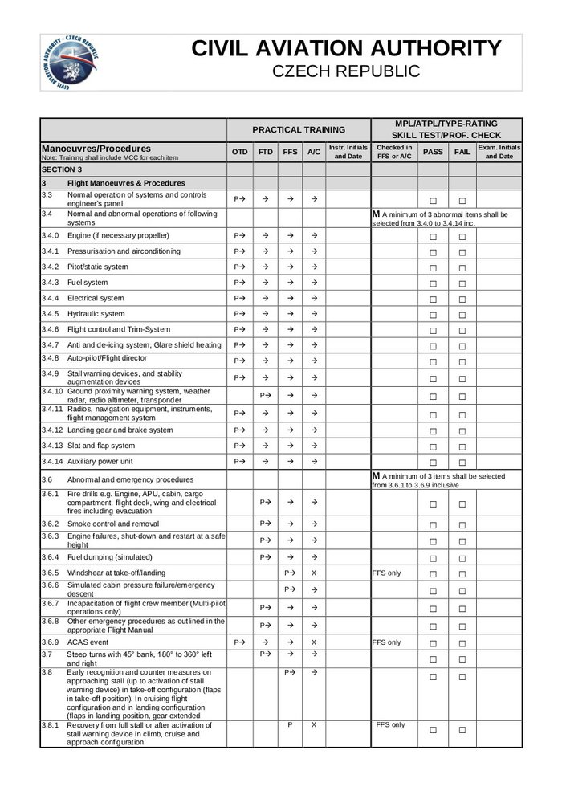
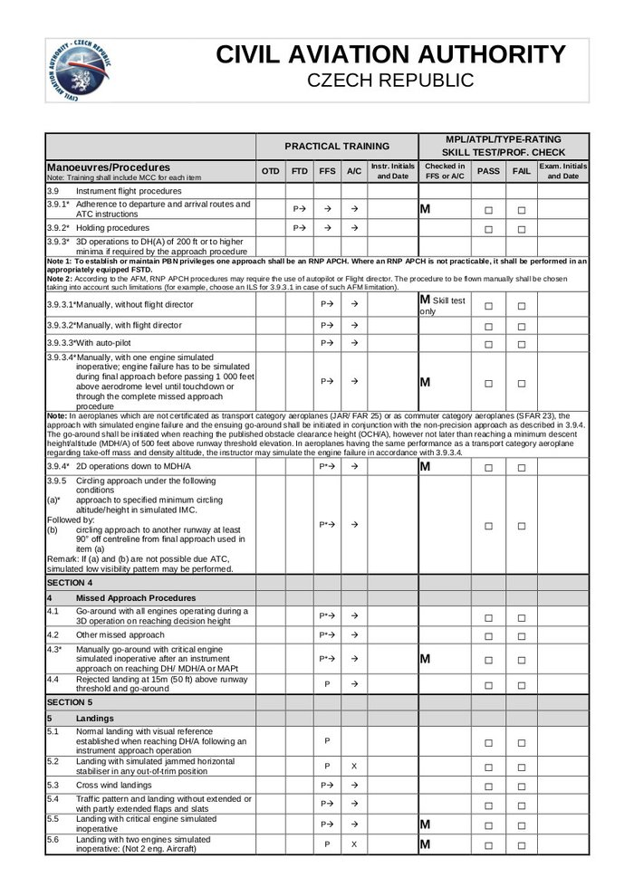
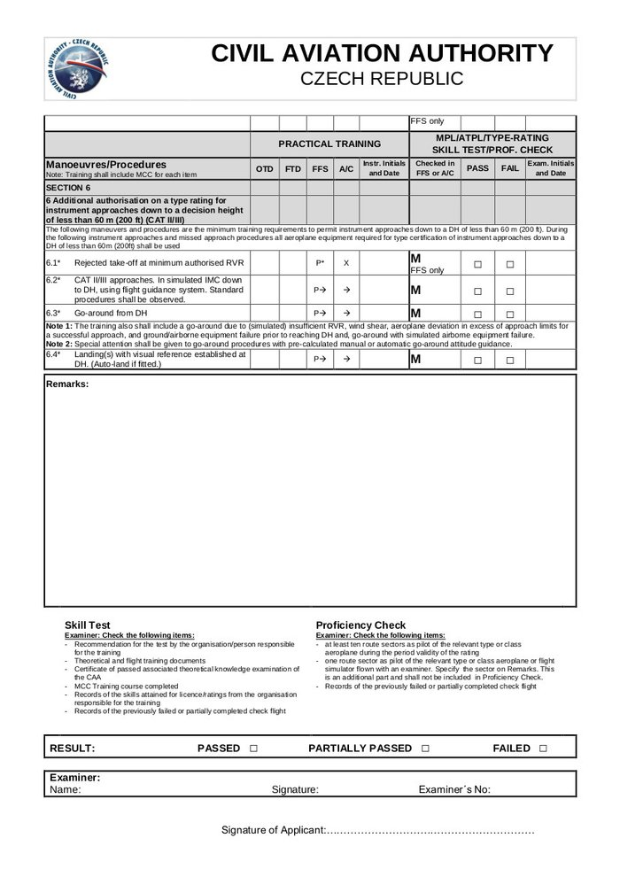
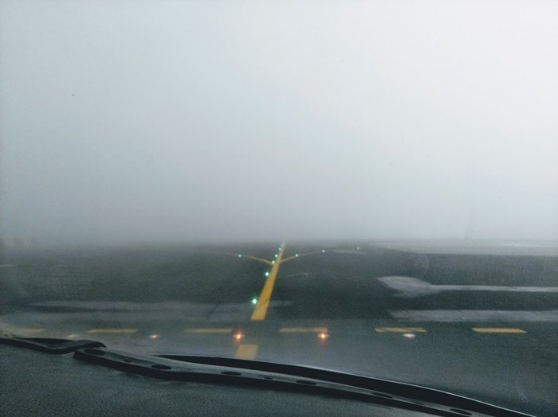

# Проверка на симуляторе

Давайте я вам расскажу, как проходит проверка пилота на симуляторе.

Раз в полгода пилот проходит 2 сессии на симуляторе, каждая по 4 часа, которая делится на две части: 2 часа в роли Pilot Flying и 2 часа в роли Pilot Monitoring. На первой сессии идет просто тренировка: вспоминаются и отрабатываются различные отказы. Вторая сессия — уже сама проверка. Я буду описывать как раз вторую часть.

Проверка начинается с брифинга, на котором инструктор/экзаменатор рассказывает откуда и куда мы полетим, какая будет погода, загрузка и вообще все, что связано с полетом. Также на брифинге он может задать теоретические вопросы по системам самолета.

Во время самой сессии нужно выполнить ряд обязательных чеков, вот по ним мы и пройдемся.

М — обязательные (mandatory) пункты проверки

<!-- more -->

Чек может выполняться как на различных типах симулятора (OTD, FTD, FFS), сертифицированных под конкретный тип самолета (type rating), так и на самом самолете (A/C). Дешевле всего, конечно, проходить все это на FFS (Full Flight Simulator), но, к примеру, на моем типе C525, можно полетать и на самолете.

#### 1. Подготовка к полету (Flight Preparation)
Тут все просто: расчет масс и скоростей, подготовка и проверка кабины, использование чеклистов, руление по перрону. Такие вещи, как визуальная инспекция самолета можно делать, конечно, только при наличии настоящего самолета, но, как я написал выше, инструктор может спросить и на брифинге (сколько дорожек имеет протектор на основных колесах?)

#### 2. Взлеты (Take–offs). А вот тут начнем подробнее.
2.1. Обычный стандартный взлет, возможно с различными значениями закрылков, включая "ускоренный" взлет. На моем типе взлетать можно с закрылками 15 и 0 (например, после де–айса). На 737, если мне не изменяет память, взлетать можно с закрылками 5 и 1. В зависимости от конфигурации будут разные скорости (V1, Vr, Vref), их нужно правильно посчитать. Ускоренный взлет — это либо rolling take–off, когда выезжают на полосу и, не останавливаясь, выполняют взлет, либо по инструкции диспетчера "cleared for immediate take–off" — тут нужно либо быть готовым и выполнить взлет быстро, иначе борт на посадочной уйдет на второй круг, либо сказать "unable" и никуда не двигаться.

Пункт 2.2 — это просто переход из визуальной части взлета (разбег по полосе) в инструментальный, когда ты смотришь уже только на приборы. Обычно инструкторы сразу после взлета включают туман и смотреть по сторонам все равно не имеет смысла.

Взлет с боковым ветром (2.3) и взлет с максимальной массой (2.4) — все просто, обычно всегда все так и происходит.

Пункт 2.5 и сразу 2.6 уже интересные — взлет с отказом двигателя (вырубился, загорелся, оторвался и т.д.). Отказ может быть до V1 (скорость принятия решения), тогда нужно вдарить по тормозам и остановиться на полосе; сразу после V1, обычно тут главное не ударить по тормозам и продолжить взлет, правильно парируя разницу в возникшем моменте "педалями хвоста"; и даже бывает после Vr (скорость поднятия носовой стойки) — вот тут иногда приходится прерывать взлет если самолет не реагирует на штурвал.

#### 3. Маневры и процедуры (Flight Manoeuvres & Procedures)

3.1. Стандартные повороты и развороты с/без спойлеров. У меня на самолете их нет, на В737 спойлеры "включаются" при повороте штурвала более 7 градусов.

3.2. Полет на максимальной скорости. На моем типе это 0.737М, на 0.742М начинает отрабатывать звуковая сигнализация, где–то на 0.760М симулятор начинает подергиваться.
Весь раздел 3.3 и 3.4 это просто стандартное управление системами самолета в их обычном режиме.

Пункт 3.6 уже поинтереснее — это как раз симуляция и отработка отказов различных систем: 
3.6.1. Пожар двигателя, вспомогательной силовой установки (APU), пожар в кокпите, в багажном отделении, в салоне и т.д. 
3.6.2. Задымление и борьба с ним 
3.6.3. Различные отказы двигателей — распознавание и правильное реагирование. Двигатель в полете может просто заглохнуть и по ряду параметров можно определить, что его можно перезапустить. А может быть ситуация серьезнее и "полетела турбина", тогда перезапуск может привести к пожару. А может быть просто повышенная температура ITT/EGT, высокая температура масла, и достаточно просто уменьшить режим. 
3.6.4. Сброс топлива — не на всех типах это возможно 
3.6.5. Сдвиг ветра на взлете и посадке — я бы сказал, один из самых сложных элементов, даже пожар двигателя не такой страшный, а вот грохнуться в землю или в гору из–за сдвига ветра страшно даже на симуляторе. 
3.6.6. Разгерметизация и аварийное снижение — может быть как медленная разгерметизация, которую можно успеть заметить по приборам, так и быстрая (rapid). Тогда происходит бум в кабине, нужно быстро натянуть маски и начать снижение. 
3.6.7. "Отключка" одного из пилотов — обычно просто потеря сознания, но в реальной жизни может быть еще и отравление, эпилепсия, либо сам пилот в сознании, но где–то в своей реальности. Инструктор может похлопать по плечу твоего напарника по симулятору, показывая, чтобы он "отключился", тебе же нужно это распознать и принять правильные действия. В прошлый раз я получил от экзаменатора записку "Please be dead"  
3.6.8. Другие отказы. Так как самолеты разные, с разными системами, то невозможно все это расписать в форме. Поэтому на усмотрение экзаменатора он может включить тот или иной отказ системы, и даже их комбинацию. Например, на моем типе самая распространенная комбинация: пожар одного двигателя и отказ генератора на другом — в этом случае самолет лишается электроэнергии и есть всего 30 минут на батарейке при минимальном наборе авионики. В принципе, все, что может сломаться на реальном самолете симулируется на тренажере. 
3.6.9. Коллизии в воздухе — не столкнуться и правильно среагировать на сигнализацию TCAS. 
3.7. "Крутые" повороты и развороты на 360 градусов без автопилота (он так не сможет) и директоров. У некоторых вызывает трудности развернуться на 360 градусов при этом удерживая постоянную скорость и высоту. 
3.8. Распознавание сваливания и выходы из него 

3.9. Стандартные полеты по приборам. По большей части скукота, когда можно немного отдохнуть, кроме пары пунктов.
3.9.3.1. Заход на руках без директоров
3.9.3.4. Заход на руках с одним отказавшим двигателем. Обычно выполняется в сумме раза 3–4 за всю проверку с хорошим боковым ветром и без директоров.

#### 4. Процедуры по уходу на второй круг (Missed Approach Procedures)

4.1. Уход на второй со всеми работающими двигателями 
4.3. Уход на второй на руках (без автопилота, без директоров, возможно даже с отказавшим навигационным дисплеем, который "рисует" тебе маршрут) с одним отказавшим двигателем. Тоже выполняется раза 3–4 за проверку. 

#### 5. Приземления

5.1. Обычные стандартные приземления 
5.2. Посадка с заблокированным горизонтальным стабилизатором 
5.3. Посадка с боковым ветром. Обычно ставят максимальный разрешенный боковик. 
5.4. Посадка с нестандартным положением закрылок 
5.5. Посадка с одним отказавшим двигателем 
5.6. Посадка с двумя отказавшими двигателями. Вообще, этот пункт для трех и более двигательных самолетов, но лично я обычно прошу дополнительно включить этот пункт во время своих полетов на симуляторе. 

Секция 6 для полетов в условиях пониженной видимости (CAT II/CAT III). Мой тип не сертифицирован под такие полеты, поэтому я эту проверку не прохожу. Но мы дополнительно отрабатываем взлет при видимости 150 метров. В реальности это выглядит примерно так

В конце проходит де–брифинг, где обсуждается, что пошло не так, что можно было сделать лучше, а что было хорошо.

Вот как–то так проходит чек на симуляторе. Если вам кто–то будет говорить, что пилоты никогда не летали на руках и не отрабатывали уход на второй круг без автопилота — не верьте, все мы летаем, и все отрабатываем.