# Полеты и радиация

Я летаю пилотом на бизнес–джетах и обычно на эшелонах FL400–FL450. Мои коллеги из авиалиний, которые выше FL360 не поднимаются, шутят, что на таких высотах нужно уже надевать что–то свинцовое. На днях получилось достать дозиметр и посмотреть, как сильно все таки там фонит наверху.

Измерения проводились с помощью Voltcraft Gamma Check. У нас не было возможности задерживаться на определенных эшелонах и делать по 3–5 измерений, поэтому на точность не претендую. Ну и так как самолет, на котором я летаю, набирает высоту очень резво, то первая отметка получилась только на FL180/5.5 км, раньше просто не было времени на все это.

На земле (1180 футов/360 метров над уровнем моря) в самолете прибор показывал от 0.01 до 0.06 мкЗв/час.
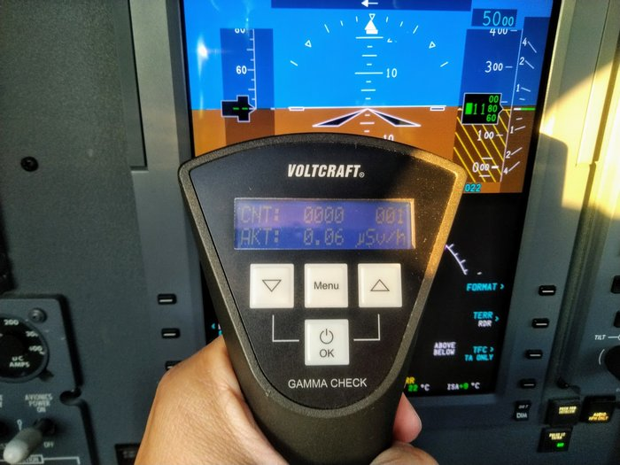
<!-- more -->
FL180 или 5.5 км — 0.34 мкЗв/час. На этой высоте летают большинство турбопропов, такие как ATR42/72 или Dash Q400.
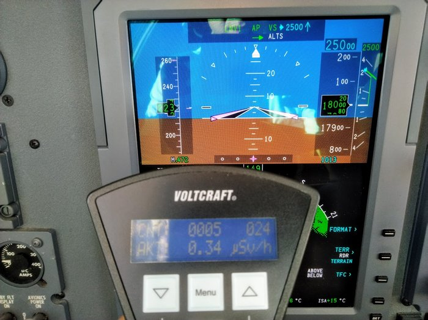

FL260 или 7.9 км — 1.46 мкЗв/час. Турбопропы на такие эшелоны уже не вылазят, но можно встретить в наборе или снижении уже самые обычные пассажирские самолеты B737/A320/SSJ100.
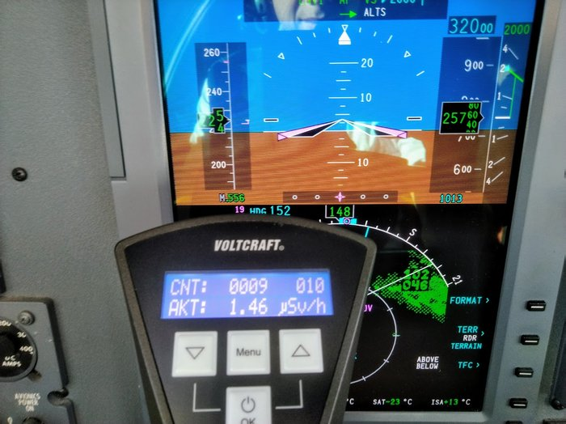

FL320 или 9.7 км — 2.05 мкЗв/час. Примерно на этой высоте летают самолеты на небольшие расстояния до 1–2 часов.
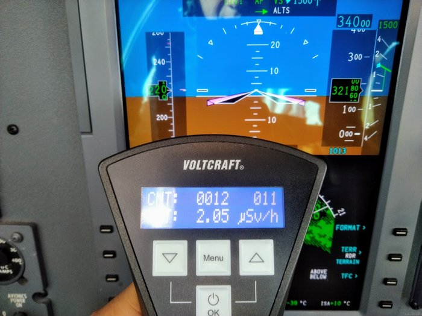

FL340 или 11 км — 2.5 мкЗв/час.
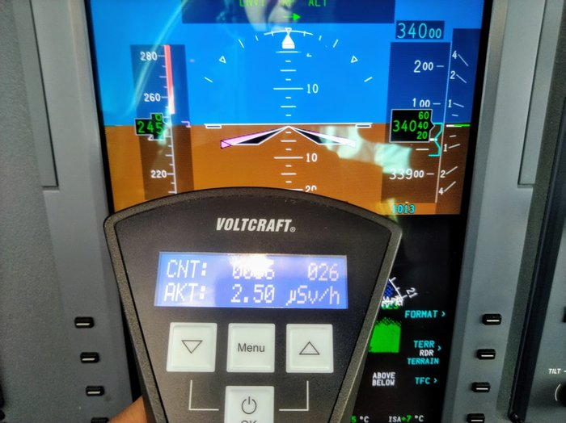

FL400 или 12.2 км — 2.95 мкЗв/час. На таких высотах летают лайнеры (например B787/A340) на очень большие расстояния, и уже появляются бизнес–джеты.
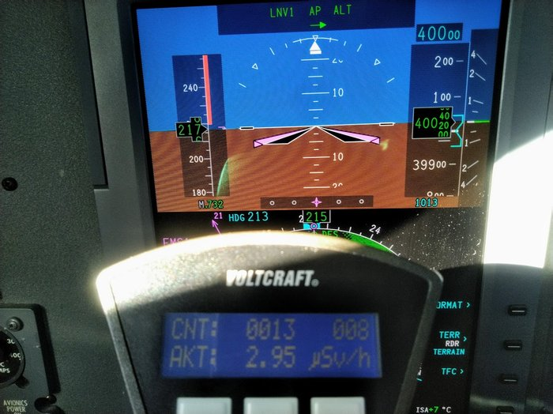

В пике на солнце получилось намерить 3.79 мкЗв/час.
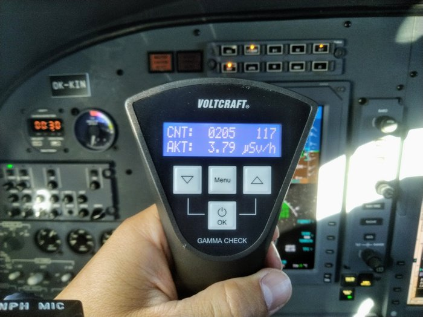

Вообще, если закрыться светоотражающими шторками и положить прибор подальше от окна, то показания получаются меньше: 2.5–2.9 мкЗв/час
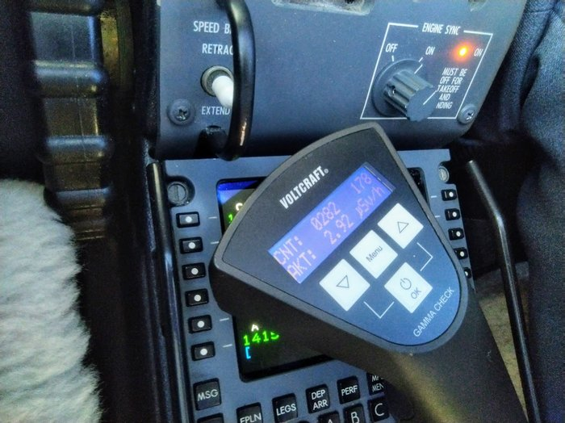

И еще несколько измерений от коллеги на А320 (на фото справа в центре высота в футах, внизу справа в рамке высота в метрах)

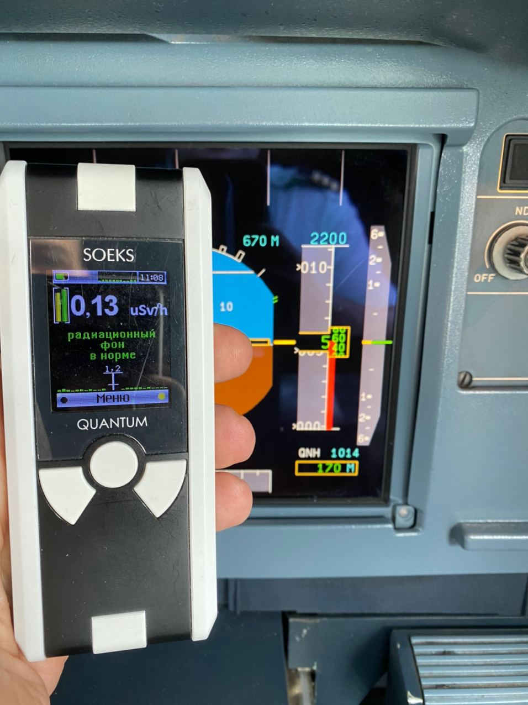

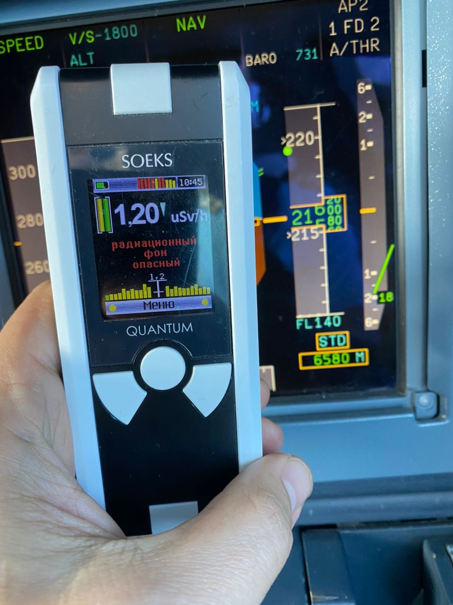

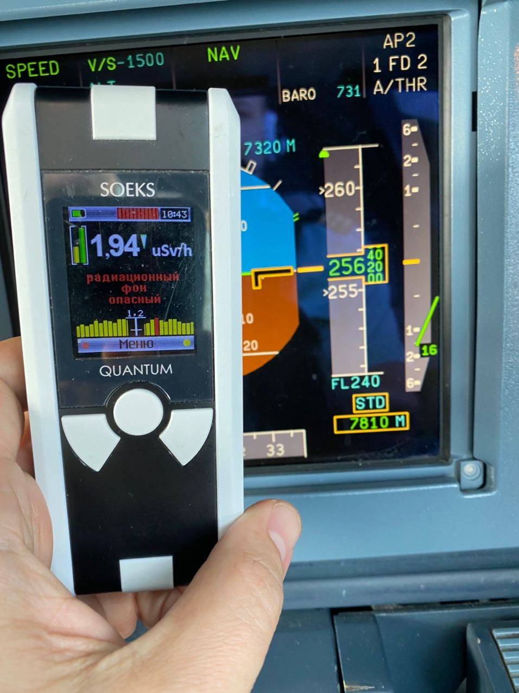

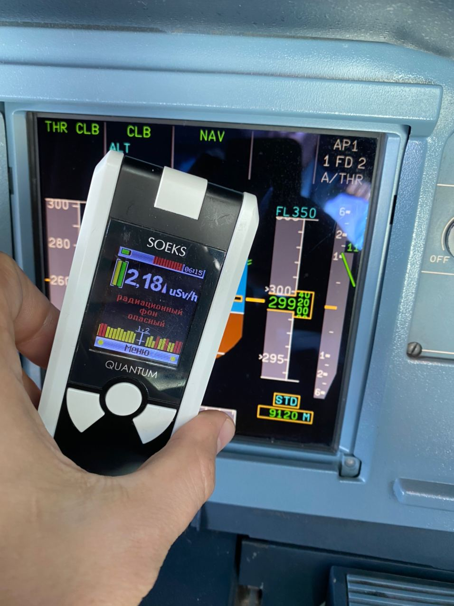

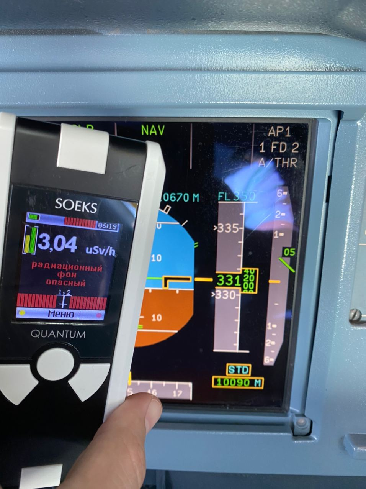

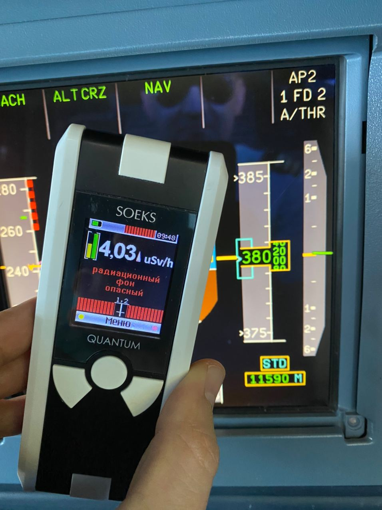

Что теперь со всем эти делать? Предположим, вы летите из Москвы в Прагу, полет занимает 2 часа на эшелоне FL340. За это время вы получите 2*2.5=5 мкЗв. Много это или мало... судя по [картинке](https://xkcd.com/radiation/) ниже, это как получить дозу радиации во время рентгена у зубного.
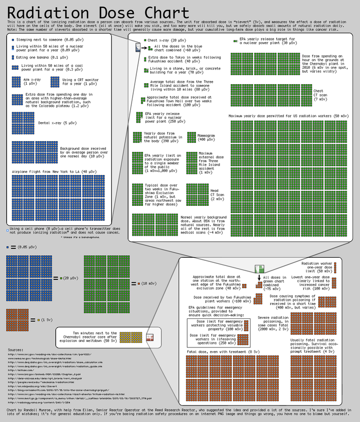