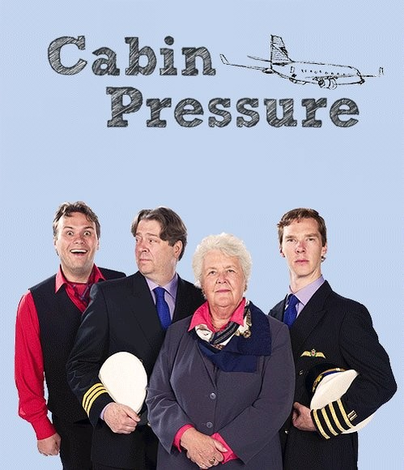

# Cabin Pressure

Для любителей авиации и подкастов хочется посоветовать один очень (на мой вгляд) интересный радио сериал от BBC - Cabin Pressure.

Несколько сезонов о "приключениях" одной очень маленькой авиакомпании в стиле английского юмора. Найти можно в свободном доступе в гугле, например [тут](https://www.podchaser.com/podcasts/cabin-pressure-1551622/episodes/recent) или [тут](https://castbox.fm/channel/id3185059?country=us), есть даже в Google Podcasts. Заодно подучите английский.

Когда я в первый раз наткнулся на этот сериал, я только только получил свою первую лицензию частного пилота, и слушал его примерно "о, да, интересно и смешно, но как-то маловероятно в обычной жизни". Сейчас, после почти 5 лет в бизнес-авиации я периодически его переслушиваю, но уже с "хех, вот был у меня примерно похожий случай...".