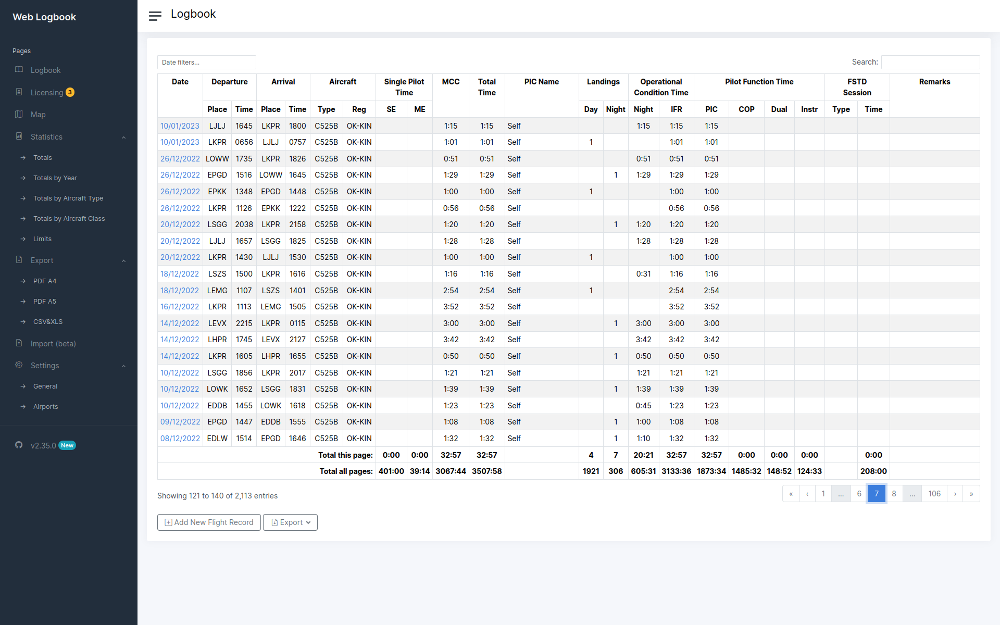
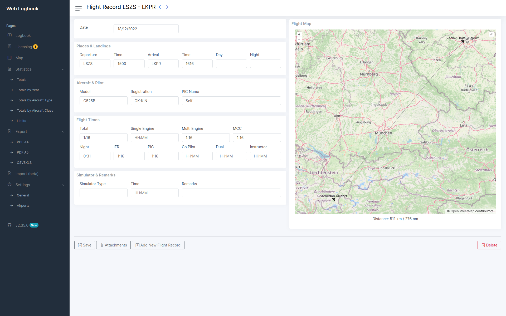

---
authors:
  - vsimakhin
categories:
  - Fly For Fun
  - All
tags:
  - Logbook
  - Fly For Fun
  - EASA
  - ATPL
  - CPL
  - PPL
  - IR
  - MEP
---

# Логбук

В качестве логбука я использую приложение [Web Logbook](https://github.com/vsimakhin/web-logbook), которое сам же и написал в свободное от полетов время.

Это относительно простое, бесплатное и opensource приложение для ведения логбука в формате EASA, написанное на golang. При запуске автоматически создается локальная база данных SQLite, а доступ к самому приложению осуществляется через любой браузер по адресу [http://localhost:4000](http://localhost:4000)

Более подробное описание можно найти тут [https://github.com/vsimakhin/web-logbook](https://github.com/vsimakhin/web-logbook)